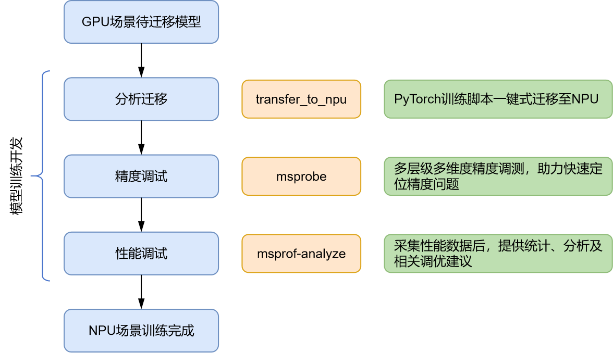

# 🚨 重要通知

**1. Ascend Training Tools 更名为 MindStudio Training Tools (mstt)。**

**2. 本代码仓 URL 变更为 [https://gitee.com/ascend/mstt](https://gitee.com/ascend/mstt)，原 URL 仍然可用（2024.07.04 ）。**

---

# 🧰 MindStudio Training Tools

## [模型训练开发全流程](https://www.hiascend.com/software/mindstudio/training)

mstt包括精度工具（msprobe）和性能工具（msprof-analyze），分析迁移工具请参见[昇腾社区](https://www.hiascend.com/software/mindstudio/training)。

# 使用说明

## [精度工具](./debug/accuracy_tools/)

[MindStudio Probe（msprobe，MindStudio 精度调试工具）](./debug/accuracy_tools/msprobe)。

## [性能工具](./profiler/msprof_analyze)

1. [compare_tools（性能比对工具）](./profiler/msprof_analyze/compare_tools)

   提供 NPU 与 GPU 性能拆解功能以及算子、通信、内存性能的比对功能。

2. [cluster_analyse（集群分析工具）](./profiler/msprof_analyze/cluster_analyse)

   提供多机多卡的集群分析能力（基于通信域的通信分析和迭代耗时分析）, 当前需要配合 MindStudio Insight 的集群分析功能使用。

3. [advisor](./profiler/msprof_analyze/advisor)

   将 Ascend PyTorch Profiler 或者 msprof 采集的 PyTorch 场景性能数据进行分析，并输出性能调优建议。

4. [bind_core](./profiler/affinity_cpu_bind)

   绑核脚本，支持非侵入修改工程代码，实现一键式绑核功能。

5. [msMonitor](./msmonitor)

   MindStudio一站式在线监控工具。

## [Tensorboard](./plugins/tensorboard-plugins/tb_graph_ascend)
Tensorboard 支持模型结构进行分级可视化展示的插件 tb-graph-ascend。

可将模型的层级关系、精度数据进行可视化，并支持将调试模型和标杆模型进行分视图展示和关联比对，方便用户快速定位精度问题。

## 分支维护策略

1. MindStudio Training Tools 工具版本分支的维护阶段如下：

   | **状态**            | **时间** | **说明**                                         |
   | ------------------- | -------- | ------------------------------------------------ |
   | 计划                | 1—3 个月 | 计划特性                                         |
   | 开发                | 3个月    | 开发特性                                         |
   | 维护                | 6—12个月 | 合入所有已解决的问题并发布版本                   |
   | 无维护              | 0—3 个月 | 合入所有已解决的问题，无专职维护人员，无版本发布 |
   | 生命周期终止（EOL） | N/A      | 分支不再接受任何修改                             |

2. MindStudio Training Tools 分支版本号命名规则如下：

   mstt 仓每年发布 4 个版本，每个版本都将对应一个分支；以 v6.0 为例，其将对应 v6.0.RC1、v6.0.RC2、v6.0.RC3 以及 v6.0.0 四个版本，在仓库中将存在与之对应的分支。

   | **分支**      | **状态** | **发布日期** | **后续状态**               | **EOL日期** |
   | ------------- | -------- | ------------ | ------------------------ | ----------- |
   | **v6.0.0** | 维护     | 2023.12.12   | 预计 2024.12.12 起无维护    |             |
