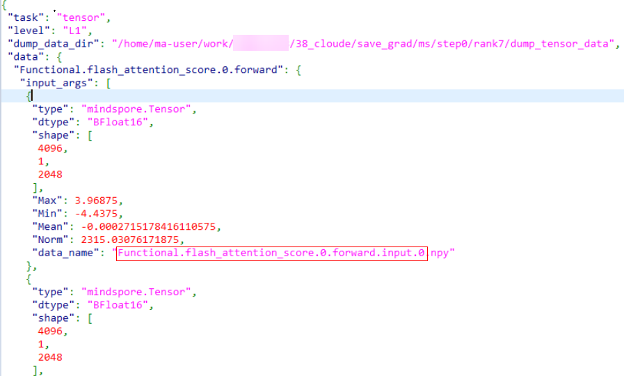
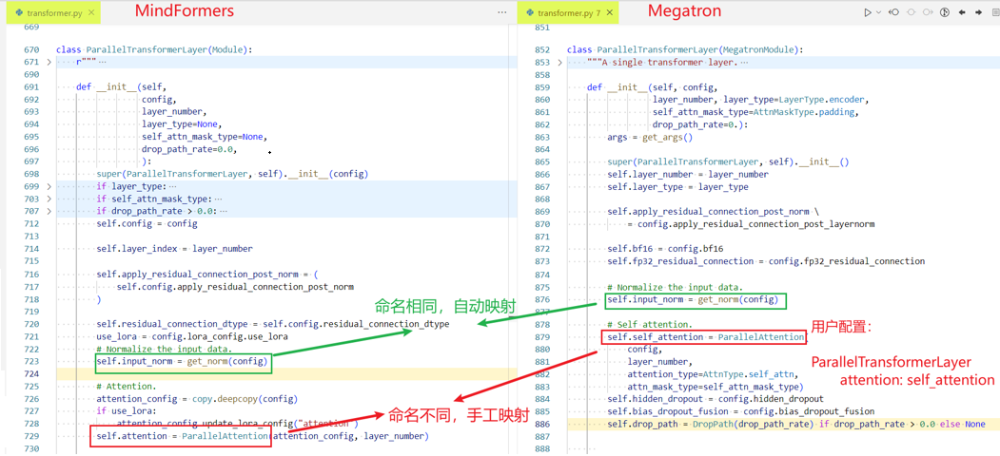

# MindSpore 场景的精度比对

## 🚨 重要通知

**1. 精度比对已支持自动识别stack.json并呈现NPU_Stack_Info，用户可无需配置compare.json中的"stack_path"字段和命令行中的-s参数。具体使用参见“4.1 比对文件”中的参数说明。命令行方式中的-s（--stack_mode）将于2025.9.30废弃，并且不再需要配置compare.json中的"stack_path"字段。**


## 1 简介

msprobe精度比对工具主要用于如下场景：

- MindSpore框架内比对
  - 通过对同一个网络模型，在两个不同版本的MindSpore静态图环境下，输入相同的训练数据，在分别得到API dump数据后，对这两个API dump数据进行全量自动比对，从而快速定位不同版本之间的精度问题。
  - 通过对同一个网络模型，在两个不同版本的MindSpore静态图环境下，输入相同的训练数据，在分别得到kernel dump数据后，对这两个kernel dump数据进行全量自动比对，从而快速定位不同版本之间的精度问题。
  - 通过对同一个网络模型，在两个不同版本的MindSpore动态图环境下，输入相同的训练数据，在分别得到cell dump数据后，对这两个cell模块进行全量自动比对，从而快速定位不同版本之间的精度问题。
- MindSpore与PyTorch跨框架比对
  - 通过对同一个网络模型，在整网环境下分别在MindSpore动态图和PyTorch环境下获得API dump数据，以PyTorch数据作为标杆，进行自动比对，从而实现跨框架的精度对比。
  - 通过对同一个网络模型，在整网环境下分别在MindSpore动态图和PyTorch环境下获得cell dump数据，由用户指定可以比对的cell list，以PyTorch数据作为标杆，进行自动比对，从而实现跨框架的精度对比。
  - 通过对同一个网络模型，在整网环境下分别在MindSpore动态图和PyTorch环境下获得API或模块dump数据，由用户指定可以比对的API或模块，以PyTorch数据作为标杆，进行自动比对，从而实现跨框架的精度对比。
  - 通过对同一个网络模型，在整网环境下分别在MindSpore动态图和PyTorch环境下获得API或模块dump数据，由用户指定可以比对的模型代码中的Layer层，以PyTorch数据作为标杆，进行自动比对，从而实现跨框架的精度对比。

执行精度比对操作需要安装msprobe工具。详见[《msprobe 工具安装指南》](./01.installation.md)。

## 2 命令行比对

精度比对工具目前使用方式为命令行形式。

### 2.1 比对命令说明

命令示例如下：

```shell
msprobe -f mindspore compare -i ./compare.json -o ./output -s
```

**完整参数说明**

| 参数名                 | 说明                                                                                                                                                                                                                                               | 是否必选 |
|---------------------|--------------------------------------------------------------------------------------------------------------------------------------------------------------------------------------------------------------------------------------------------| -------- |
| -f 或 --framework    | 指定训练框架。mindspore。                                                                                                                                                                                                                                | 是                                 |
| -i或--input_path     | 指定比对文件。比对文件内容及示例请参见[比对文件](#41-比对文件)或[比对文件（kernel）](#42-比对文件kernel)（比对文件（kernel）仅[不同版本下的全量kernel比对](#23-不同版本下的全量kernel比对)场景支持）。                                                                                                                   | 是       |
| -o或--output_path    | 配置比对结果文件存盘目录，默认会在当前目录创建output目录。文件名称基于时间戳自动生成，格式为：<br>        `compare_result_{timestamp}.xlsx`<br/>        `compare_result_{rank_id}_{step_id}_{timestamp}.xlsx`（仅[不同版本下的全量kernel比对](#23-不同版本下的全量kernel比对)场景支持）。<br>提示：output目录下与结果件同名文件将被删除覆盖。 | 否       |
| -s或--stack_mode     | 比对结果展示调用栈信息（NPU_Stack_Info）的开关，bool 类型。单卡场景开启时，需要使用[比对文件](#41-比对文件)的单卡场景配置stack_path指定stack.json文件，才能生成详细调用栈信息，否则在比对时会报错；暂不支持多卡场景。通过直接配置该参数开启，默认未配置，表示关闭。                                                                                        | 否       |
| -c或--compare_only   | 仅比对开关，bool 类型。该参数默认未配置，会启用自动精度分析，工具自动针对比对结果进行分析，识别到第一个精度可能不达标节点（在比对结果文件中的 Accuracy Reached or Not 列显示为 No），并给出问题可能产生的原因（打屏展示并生成 `advisor_{timestamp}.txt` 文件）。通过配置该参数取消自动精度分析，仅输出比对结果表格。                                                         | 否       |
| -f或--fuzzy_match    | 模糊匹配。开启后，对于网络中同一层级且命名仅调用次数不同的API，可匹配并进行比对。通过直接配置该参数开启，默认未配置，表示关闭。                                                                                                                                                                                | 否       |
| -hl或--highlight     | 高亮颜色标记。开启后，比对结果件中通过红色或黄色标记精度可疑API或模块。通过直接配置该参数开启，默认未配置，表示关闭。 开启高亮颜色标记后，比对性能降低，如果比对结果行数超出excel单页限制，程序强制关闭高亮颜色标记。                                                                                                                                  | 否       |
| -am或--api_mapping   | 跨框架比对。配置该参数时表示开启跨框架API比对功能，可以指定自定义映射文件*.yaml，不指定映射文件时按照msprobe定义的默认映射关系进行比对。自定义映射文件的格式请参见[自定义映射文件（api_mapping）](#43-自定义映射文件api_mapping)。仅[跨框架的API比对](#25-跨框架的api比对)场景需要配置。                                                                       | 否       |
| -cm或--cell_mapping  | 跨框架比对。配置该参数时表示开启跨框架cell模块比对功能，可以指定自定义映射文件*.yaml，不指定映射文件时按照msprobe定义的默认映射关系进行比对。自定义映射文件的格式请参见[自定义映射文件（cell_mapping）](#44-自定义映射文件cell_mapping)。仅[跨框架的cell模块比对](#26-跨框架的cell模块比对)场景需要配置。                                                            | 否       |
| -dm或--data_mapping  | 同框架或跨框架比对。通过映射文件指定两个具体参数的对应关系，可以在L0、L1或mix采集场景下使用。配置该参数的同时需要指定自定义映射文件*.yaml。自定义映射文件的格式请参见[自定义映射文件（data_mapping）](#45-自定义映射文件data_mapping)。                                                                                                       | 否       |
| -lm或--layer_mapping | 跨框架比对。配置该参数时表示开启跨框架Layer层的比对功能，指定模型代码中的Layer层后，可以识别对应dump数据中的模块或API。需要指定自定义映射文件*.yaml。自定义映射文件的格式请参见[自定义映射文件（Layer_mapping）](#46-自定义映射文件layer_mapping)。仅[跨框架的Layer层比对](#27-跨框架的layer层比对)场景需要配置。                                                   | 否       |
| -da或--diff_analyze  | 自动识别网络中首差异节点，支持md5、统计量等dump数据。支持单卡/多卡场景。                                                                         | 否       |

动态图模式没有填写任何mapping时，按照同框架比对的方式进行比对，比对数据和标杆数据的Cell或Api名称需要完全相同才能匹配得上。

### 2.2 不同版本下的全量API比对

1. 参见《[MindSpore 场景的精度数据采集](./06.data_dump_MindSpore.md)》完成不同环境下MindSpore静态图精度数据的采集，得到不同框架版本的API dump数据。

2. 创建比对文件，文件内容及示例请参见[比对文件](#41-比对文件)。

3. 执行如下示例命令进行比对：

   ```shell
   msprobe -f mindspore compare -i ./compare.json -o ./output -s
   ```

4. 查看比对结果，请详见PyTorch目录下的《[PyTorch 场景的精度比对-精度比对结果分析](./10.accuracy_compare_PyTorch.md#3-精度比对结果分析)》章节。

### 2.3 不同版本下的全量kernel比对

1. 参见《[MindSpore 场景的精度数据采集](./06.data_dump_MindSpore.md)》完成不同环境下MindSpore静态图精度数据的采集，得到不同框架版本的kernel dump数据。

2. 创建比对文件，文件内容及示例请参见[比对文件（kernel）](#42-比对文件kernel)。

3. 执行如下示例命令进行比对：

   ```shell
   msprobe -f mindspore compare -i ./compare.json -o ./output
   ```

   该场景仅支持compare的-i和-o参数。

4. 查看比对结果，请详见PyTorch目录下的《[PyTorch 场景的精度比对-精度比对结果分析](./10.accuracy_compare_PyTorch.md#3-精度比对结果分析)》章节。

### 2.4 不同版本下的cell模块比对

1. 配置[config.json](../config.json)文件level配置为L0、task配置为tensor或statistics并指定需要dump的cell模块名。

2. 参见《[MindSpore 场景的精度数据采集](./06.data_dump_MindSpore.md)》完成不同环境下MindSpore动态图精度数据的采集，得到不同框架版本的cell模块dump数据。

3. 创建比对文件，文件内容及示例请参见[比对文件](#41-比对文件)。

4. 执行如下示例命令进行比对：

   ```shell
   msprobe -f mindspore compare -i ./compare.json -o ./output -s
   ```

5. 查看比对结果，请详见PyTorch目录下的《[PyTorch 场景的精度比对-精度比对结果分析](./10.accuracy_compare_PyTorch.md#3-精度比对结果分析)》章节。

### 2.5 跨框架的API比对

1. 配置[config.json](../config.json)文件level配置为L1、task配置为tensor或statistics。

2. 参见《[MindSpore 场景的精度数据采集](./06.data_dump_MindSpore.md)》和《[PyTorch 场景的精度数据采集](./05.data_dump_PyTorch.md)》完成不同环境下API精度数据的采集，得到两个框架的API dump数据。

3. 创建比对文件，文件内容及示例请参见[比对文件](#41-比对文件)。

4. 执行如下示例命令进行比对：

   ```shell
   msprobe -f mindspore compare -i ./compare.json -o ./output -s -am
   ```

   或

   ```shell
   msprobe -f mindspore compare -i ./compare.json -o ./output -s -am api_mapping.yaml
   ```

   api_mapping.yaml文件配置请参见[自定义映射文件（api_mapping）](#43-自定义映射文件api_mapping)。
   不传入api_mapping.yaml的情况下将按照内置的api映射进行匹配；传入api_mapping.yaml的情况下优先按照api_mapping.yaml的内容进行匹配，api_mapping.yaml中没有涉及的按照内置的api映射进行匹配。

   此外，也可以通过data_mapping.yaml文件实现具体参数的匹配，例：
   ```shell
   msprobe -f mindspore compare -i ./compare.json -o ./output -s -dm data_mapping.yaml
   ```
   data_mapping.yaml的写法请参见[自定义映射文件（data_mapping）](#45-自定义映射文件data_mapping)。

5. 查看比对结果，请详见PyTorch目录下的《[PyTorch 场景的精度比对-精度比对结果分析](./10.accuracy_compare_PyTorch.md#3-精度比对结果分析)》章节。

### 2.6 跨框架的cell模块比对

1. 配置[config.json](../config.json)文件level配置为L0、task配置为tensor或statistics并指定需要dump的cell模块名。

2. 参见《[MindSpore 场景的精度数据采集](./06.data_dump_MindSpore.md)》和《[PyTorch 场景的精度数据采集](./05.data_dump_PyTorch.md)》完成不同环境下cell模块精度数据的采集，得到两个框架的cell模块dump数据。

3. 创建比对文件，文件内容及示例请参见[比对文件](#41-比对文件)。

4. 执行如下示例命令进行比对：

   ```shell
   msprobe -f mindspore compare -i ./compare.json -o ./output -s -cm
   ```

   或

   ```shell
   msprobe -f mindspore compare -i ./compare.json -o ./output -s -cm cell_mapping.yaml
   ```

   cell_mapping.yaml文件配置请参见[自定义映射文件（cell_mapping）](#44-自定义映射文件cell_mapping)。
   不传入cell_mapping.yaml的情况下仅将Cell改成Module后进行匹配；传入cell_mapping.yaml的情况下将按照cell_mapping.yaml的内容进行匹配。

   此外，也可以通过data_mapping.yaml文件实现具体参数的匹配，例：
   ```shell
   msprobe -f mindspore compare -i ./compare.json -o ./output -s -dm data_mapping.yaml
   ```
   data_mapping.yaml的写法请参见[自定义映射文件（data_mapping）](#45-自定义映射文件data_mapping)。

5. 查看比对结果，请详见PyTorch目录下的《[PyTorch 场景的精度比对-精度比对结果分析](./10.accuracy_compare_PyTorch.md#3-精度比对结果分析)》章节。

### 2.7 跨框架的Layer层比对

layer_mapping可以从Layer层识别整网的API和Cell，简化配置。

1. 配置[config.json](../config.json)文件level配置为L0或mix、task配置为tensor或statistics并指定需要dump的API或模块名。

2. 参见《[MindSpore 场景的精度数据采集](./06.data_dump_MindSpore.md)》和《[PyTorch 场景的精度数据采集](./05.data_dump_PyTorch.md)》完成不同环境下API或模块精度数据的采集，得到两个框架的API或模块dump数据。

3. 创建比对文件，文件内容及示例请参见[比对文件](#41-比对文件)。

4. 执行如下示例命令进行比对：

   ```shell
   msprobe -f mindspore compare -i ./compare.json -o ./output -s -lm layer_mapping.yaml
   ```

   layer_mapping.yaml文件配置请参见[自定义映射文件（layer_mapping）](#46-自定义映射文件layer_mapping)。

   此外，也可以通过data_mapping.yaml文件实现具体参数的匹配，例：
   ```shell
   msprobe -f mindspore compare -i ./compare.json -o ./output -s -dm data_mapping.yaml
   ```
   data_mapping.yaml的写法请参见[自定义映射文件（data_mapping）](#45-自定义映射文件data_mapping)。

5. 查看比对结果，请详见PyTorch目录下的《[PyTorch 场景的精度比对-精度比对结果分析](./10.accuracy_compare_PyTorch.md#3-精度比对结果分析)》章节。

### 2.8 单点数据比对
1. 参见 [单点保存工具](./28.debugger_save_instruction.md)章节完成 CPU 或 GPU 与 NPU 的单点数据采集。

2. 创建比对文件，文件内容及示例请参见[比对文件(单点数据)](#47-比对文件单点数据)。

3. 执行如下示例命令进行比对：

   ```shell
   msprobe -f mindspore compare -i ./compare.json -o ./output
   ```

4. Pytorch & MindSpore 动态图场景查看比对结果，请详见PyTorch目录下的《[PyTorch 场景的精度比对-精度比对结果分析](./10.accuracy_compare_PyTorch.md#3-精度比对结果分析)》章节。
MindSpore静态图场景比对结果：
- `result.csv` 文件列出了所有执行精度比对的 单点保存数据 详细信息和比对结果，示例如下：

  
具体字段含义同PyTorch目录下的《[PyTorch 场景的精度比对-精度比对结果分析](./10.accuracy_compare_PyTorch.md#3-精度比对结果分析)》章节。

### 2.9 首差异算子节点识别
参见《[PyTorch 场景的精度比对-首差异算子节点识别](./10.accuracy_compare_PyTorch.md#215-首差异算子节点识别场景)》章节。

## 3 多卡比对结果提取汇总通信算子数据

本功能是将多卡比对场景的比对结果，进行通信算子数据提取和汇总，输出整理好的通信算子多卡比对精度表。

**使用场景**

已完成精度比对，获得多卡精度比对结果，但是通信算子数据分布在多个结果件中，不利于精度问题的分析。通过此功能，可以汇总多卡通信算子数据，减少问题定位时间。

**约束**

- 不支持MD5比对结果。
- 不支持MindSpore静态图比对结果。

**命令示例**

```bash
msprobe -f mindspore merge_result -i ./input_dir -o ./output_dir -config ./config.yaml
```

**完整参数说明**

| 参数名                   | 说明                                                                                                                | 是否必选 |
|-----------------------|-------------------------------------------------------------------------------------------------------------------| -------- |
| -f 或 --framework      | 指定训练框架。mindspore。                                                                                                                     | 是                   |
| -i 或 --input_dir      | 多卡比对结果存盘目录，即使用compare比对的结果输出目录，str类型。所有比对结果应全部为真实数据比对结果或统计数据比对结果，否则可能导致汇总数据不完整。                                   | 是       |
| -o 或 --output_dir     | 数据提取汇总结果存盘目录，str类型。文件名称基于时间戳自动生成，格式为：`multi_ranks_compare_merge_{timestamp}.xlsx`。<br>提示：output目录下与结果件同名文件将被删除覆盖。 | 是       |
| -config或--config-path | 指定需要汇总数据的API和比对指标的yaml文件路径，str类型。<br>yaml文件详细介绍见下文“**yaml文件说明**”。                                                 | 是       |

**yaml文件说明**

以config.yaml文件名为例，配置示例如下：

```
api:
- Distributed.all_reduce
- Distributed.all_gather_into_tensor
compare_index:
- Max diff
- L2norm diff
- MeanRelativeErr
```

| 参数名        | 说明                                                                                                                                                                                                                                                                                                                                                |
| ------------- |---------------------------------------------------------------------------------------------------------------------------------------------------------------------------------------------------------------------------------------------------------------------------------------------------------------------------------------------------|
| api           | 表示需要汇总的API或module名称。如果没有配置，工具会提示报错。<br/>api名称配置格式为：`{api_type}.{api_name}.{API调用次数}.{前向反向}`<br/>须按顺序配置以上四个字段，可按如下组合配置：<br/>        {api_type}<br/>        {api_type}.{api_name}<br/>        {api_type}.{api_name}.{API调用次数}<br/>        {api_type}.{api_name}.{API调用次数}.{前向反向}<br/>这里的api指代API或module。                                            |
| compare_index | 表示需要汇总的比对指标。compare_index需为dump_mode对应比对指标的子集。如果没有配置，工具将根据比对结果自动提取dump_mode对应的全部比对指标进行汇总。<br>统计数据模式比对指标：Max diff、Min diff、Mean diff、L2norm diff、MaxRelativeErr、MinRelativeErr、MeanRelativeErr、NormRelativeErr、Requires_grad Consistent<br>真实数据模式比对指标：Cosine、EucDist、MaxAbsErr、MaxRelativeErr、One Thousandth Err Ratio、Five Thousandths Err Ratio、Requires_grad Consistent |

**汇总结果件说明**

多卡数据汇总结果如下所示：


1. NPU Name列表示API或module名称。
2. rank*列为多卡数据。
3. 不同比对指标的数据通过不同sheet页呈现。
4. 如果一个API或module在某张卡上找不到数据，汇总结果中将空白呈现。
5. 如果比对指标值为N/A，unsupported，Nan，表示无法计算该比对指标值，汇总结果将以”NPU:’NPU max值‘  Bench:’Bench max值‘“呈现。
6. 针对图示案例，此处NPU:N/A  Bench:N/A表示output为None。

<br>
如何基于group信息查看分组数据：

以Distributed.all_reduce.0.forward为例。这个API将多卡数据规约操作，输出为一个group内的规约结果，同一个group内的输出保持一致。<br>这个API中，rank0-3为一个group，Distributed.all_reduce.0.forward.input.group展示为tp-0-1-2-3，rank0-3输出一致；rank4-7为一个group，展示为tp-4-5-6-7，rank4-7输出一致。<br>group除了这种形式，还有如[0, 1, 2, 3]的呈现形式。

<br>
常见通信API预期结果：

1. Distributed.all_gather：多卡数据汇总，每张卡输入可以不一致，同group内输出一致，输出是张量列表。
2. Distributed.all_gather_into_tensor：多卡数据汇总，每张卡输入可以不一致，同group内输出一致，输出是张量。
3. Distributed.all_reduce：多卡数据规约操作，每张卡输入可以不一致，同group内输出一致，为规约结果。
4. Distributed.reduce_scatter：多卡数据规约操作，每张卡输入可以不一致，输出为group内规约结果的不同部分，输入是张量列表。
5. Distributed.reduce_scatter_tensor：多卡数据规约操作，每张卡输入可以不一致，输出为group内规约结果的不同部分，输入是张量。
6. Distributed.broadcast：输入为要广播的数据，输出为广播后的数据。
7. Distributed.isend：点对点通信，输入为要发送的数据，输出为发送的数据。
8. Distributed.irecv：点对点通信，输入为原数据，输出为接收的新数据。
9. Distributed.all_to_all_single：输出数据为所有卡上的数据切分后合并的结果。

## 4 附录

### 4.1 比对文件

以在当前目录创建./compare.json为例，单卡场景示例如下：


  ```json
{
"npu_path": "./npu_dump/dump.json",
"bench_path": "./bench_dump/dump.json",
"stack_path": "./npu_dump/stack.json",
"is_print_compare_log": true
}
  ```

多卡场景示例如下：
```json
{
"npu_path": "./npu_dump/step0",  # 需填写到step层级（rank的上一层级）
"bench_path": "./bench_dump/step0",  # 需填写到step层级（rank的上一层级）
"is_print_compare_log": true
}
```

**参数说明**

| 参数名               | 说明                                                                                                                                                                                | 是否必选 |
| -------------------- |-----------------------------------------------------------------------------------------------------------------------------------------------------------------------------------|------|
| npu_path             | 配置NPU环境下的dump.json文件（单卡场景）或dump目录（多卡场景）。跨框架场景指定为MindSpore的dump.json文件或dump目录。数据类型：str。                                                                                            | 是    |
| bench_path           | 配置CPU、GPU或NPU环境下的dump.json文件（单卡场景）或dump目录（多卡场景）。跨框架场景指定为PyTorch的dump.json文件或dump目录。数据类型：str。                                                                                      | 是    |
| stack_path           | 配置NPU dump目录下的stack.json文件。数据类型：str。如果没有配置stack_path，命令行-s参数不生效，程序自动识别是否存在stack.json文件，如存在，则比对结果中呈现NPU_Stack_Info，如不存在，则不呈现。如果配置了stack_path，比对结果中是否呈现NPU_Stack_Info则通过命令行参数-s来控制。 | 否    |
| is_print_compare_log | 配置是否开启单个算子的日志打屏。可取值true或false，默认为true。关闭后则只输出常规日志。数据类型：bool。                                                                                                                      | 否    |

### 4.2 比对文件（kernel）

仅[不同版本下的全量kernel比对](#23-不同版本下的全量kernel比对)场景支持。

以在当前目录创建./compare.json为例，示例如下：

- 单卡场景：

  ```json
  {
  "npu_path": "./npu_dump",
  "bench_path": "./bench_dump",
  "rank_id": [1],
  "step_id": []
  }
  ```

- 多卡场景：

  ```json
  {
  "npu_path": "./npu_dump",
  "bench_path": "./bench_dump",
  "rank_id": [],
  "step_id": []
  }
  ```


**参数说明**

| 参数名     | 说明                                                         | 是否必选 |
| ---------- | ------------------------------------------------------------ | -------- |
| npu_path   | 配置NPU环境下的真实数据目录。数据类型：str。                 | 是       |
| bench_path | 配置NPU环境下的真实数据目录。数据类型：str。                 | 是       |
| rank_id    | 配置比对的Rank ID。npu_path和bench_path目录下的dump文件需要存在对应Rank的数据。默认为空，表示比对所有Rank。可配置一个或多个Rank，多个Rank ID用逗号隔开，例如："rank_id": [1,2,3]。数据类型：list[int]。 | 否       |
| step_id    | 配置比对的Step ID。npu_path和bench_path目录下的dump文件需要存在对应Step的数据。默认为空，表示比对所有Step。可配置一个或多个Step，多个Step ID用逗号隔开，例如："step_id": [1,2,3]。数据类型：list[int]。 | 否       |

### 4.3 自定义映射文件（api_mapping）

文件名格式：\*.yaml，*为文件名，可自定义。

文件内容格式：

```yaml
ms_api: {ms_api_name}
pt_api: {pt_api_name}
ms_args:
- {index1}
- {index2}
...
- {indexN}
pt_args:
- {index1}
- {index2}
...
- {indexN}
ms_outputs:
- {index1}
- {index2}
...
- {indexN}
pt_outputs:
- {index1}
- {index2}
...
- {indexN}
```

- ms_api/pt_api：分别为MindSpore和PyTorch框架的API名称，配置格式为{api_type}.{api_name}。API名称请分别从《[MindSpore 场景的精度数据采集](./06.data_dump_MindSpore.md)》和《[PyTorch 场景的精度数据采集](./05.data_dump_PyTorch.md)》中的dump.json文件获取。
- ms_args/pt_args：分别为ms_api/pt_api对应的MindSpore和PyTorch框架API的入参的序号。
- ms_outputs/pt_outputs：分别为ms_api/pt_api对应的MindSpore和PyTorch框架API的输出的序号。

**说明**：

- MindSpore和PyTorch框架的API映射关系可以从《[PyTorch与MindSpore API映射表](https://www.mindspore.cn/docs/zh-CN/r2.3.0rc2/note/api_mapping/pytorch_api_mapping.html)》获取，其中PyTorch与MindSpore API名称前缀的映射关系如下：

  | PyTorch             | PyTorch在dump文件中的名称 | MindSpore        | MindSpore在dump文件中的名称 |
  | ------------------- | ------------------------- | ---------------- | --------------------------- |
  | torch.nn.functional | Functional                | mindspore.ops    | Functional                  |
  | torch.Tensor        | Tensor                    | mindspore.Tensor | Tensor                      |
  | torch               | Torch                     | mindspore.ops    | Functional                  |

  实际配置自定义映射文件（API）时需要使用dump文件中的名称。

- 自定义映射文件（API）需要满足ms_args/pt_args列表中的元素个数一致，ms_outputs/pt_outputs相同。

- 须确保列表自定义映射文件（API）配置元素的合法性，比如ms_args/pt_args的API用到的参数只有3个参数，那么用户实际指定的参数序号只能包含0、1、2；另外参数序号列表中的值不能重复。

文件内容示例：

```yaml
ms_api: Functional.abs
pt_api: Torch.abs
ms_args:
- 0
- 1
pt_args:
- 0
- 1
ms_outputs:
- 0
- 1
pt_outputs:
- 0
- 1
# ms_args/pt_args和ms_outputs/pt_outputs参数的配置需要根据ms_api/pt_api的API入参和输出的顺序，例如Functional.abs API的入参为（a b c），那对应的ms_args为0 1 2，可根据实际需要选择，而Torch.abs的入参如果是（a b c），那么ms_args和pt_args配置一致即可，但如果Torch.abs的入参如果是（a c）或其他与Functional.abs不完全映射的值，那么ms_args和pt_args配置的序号需要与入参对应，Torch.abs（a c）的序号为0 1，Functional.abs（a b c）为0 1 2，只有a和c参数可以映射，那么ms_args配置为0 2，pt_args配置为0 1。ms_outputs/pt_outputs同理。
```

### 4.4 自定义映射文件（cell_mapping）

文件名格式：\*.yaml，*为文件名，可自定义。

文件内容格式：

```yaml
{cell_name}.{class_name}: {module_name}.{class_name}
```

文件内容示例：

```yaml
fc2.Dense: fc2.Linear
conv1.Conv2d: conv3.Conv2d
```

冒号左侧为MindSpore框架cell模块的{cell_name}.{class_name}，冒号右侧为PyTorch框架module模块的{module_name}.{class_name}。

```yaml
{cell_name}.{class_name}从dump cell模块级.npy文件名获取，命名格式为：
{Cell}.{cell_name}.{class_name}.{forward/backward}.{index}.{input/output}.{参数序号/参数名}
或
{Cell}.{cell_name}.{class_name}.parameters_grad.{parameter_name}

{module_name}.{class_name}从dump module模块级.npy文件名获取，命名格式为：
{Module}.{module_name}.{class_name}.{forward/backward}.{index}.{input/output}.{参数序号/参数名}
或
{Module}.{module_name}.{class_name}.parameters_grad.{parameter_name}
```

### 4.5 自定义映射文件（data_mapping）

文件名格式：\*.yaml，*为文件名，可自定义。

文件内容格式：

```yaml
# API
{api_type}.{api_name}.{API调用次数}.{forward/backward}.{input/output}.{参数序号/参数名}: {api_type}.{api_name}.{API调用次数}.{forward/backward}.{input/output}.{参数序号/参数名}
# 模块
{Cell}.{cell_name}.{class_name}.{forward/backward}.{index}.{input/output}.{参数序号/参数名}: {Module}.{module_name}.{class_name}.{forward/backward}.{index}.{input/output}.{参数序号/参数名}
或
{Cell}.{cell_name}.{class_name}.parameters_grad.{parameter_name}: {Module}.{module_name}.{class_name}.parameters_grad.{parameter_name}
```

冒号左侧为MindSpore框架API的名称和Cell模块的名称，冒号右侧为PyTorch框架API的名称和module模块名称。

API和模块名称请分别从《[MindSpore 场景的精度数据采集](./06.data_dump_MindSpore.md)》和《[PyTorch 场景的精度数据采集](./05.data_dump_PyTorch.md)》中的dump.json文件获取。

文件内容示例：

```yaml
# API
Functional.flash_attention_score.4.forward.input.0: NPU.npu_fusion_attention.4.forward.input.0
# 模块
Cell.relu.ReLU.forward.0.input.0: Module.module.language_model.embedding.word_embedding.VocabParallelEmbedding.forward.0.input.0
或
Cell.relu.ReLU.parameters_grad.weight: Module.module.language_model.embedding.word_embedding.VocabParallelEmbedding.parameters_grad.weight
```

当dump.json文件中存在“data_name”字段时，API和模块名称为data_name字段去掉文件后缀，如下图红框处所示：

- MindSpore dump

  

- PyTorch dump

  

当dump.json文件中不存在“data_name”字段时，名称的拼写规则如下：

input_args、input_kwargs和output使用统一的命名规则，当值是list类型时，名称后面添加'.{index}'，当值类型是dict类型时，名称后面加'.{key}'，当值类型是具体Tensor或null或空list/dict时，命名结束。

以下面cell的dump文件为例：
```yaml
"Cell.network.module.NetworkWithLoss.forward.0": {
  "input_args": [
    {
      "type": "mindspore.Tensor",
      "dtype": "Float32",
      "shape": [
        24,
        16,
        1,
        60,
        34
      ],
      "Max": 3.591925621032715,
      "Min": -3.6856653690338135,
      "Mean": -0.017044123262166977,
      "Norm": 940.671630859375,
      "md5": "00d69ba8"
    },
    {
      "y": {
        "type": "mindspore.Tensor",
        "dtype": "Float32",
        "shape": [
          24,
          1,
          100,
          4096
        ],
        "Max": 2.433350086212158,
        "Min": -4.09375,
        "Mean": -0.00010696164099499583,
        "Norm": 170.3390655517578,
        "md5": "a72e1fa4"
      },
      "y_mask": {
        "type": "mindspore.Tensor",
        "dtype": "Float32",
        "shape": [
          24,
          100
        ],
        "Max": 1.0,
        "Min": 0.0,
        "Mean": 0.22999998927116394,
        "Norm": 23.494680404663086,
        "md5": "bbcbd5ab"
      },
      "x_mask": {
        "type": "mindspore.Tensor",
        "dtype": "Float32",
        "shape": [
          24,
          510
        ],
        "Max": 1.0,
        "Min": 1.0,
        "Mean": 1.0,
        "Norm": 110.63453674316406,
        "md5": "766d1028"
      },
      "loss_mask": {
        "type": "mindspore.Tensor",
        "dtype": "Float32",
        "shape": [
          24,
          1,
          60,
          34
        ],
        "Max": 1.0,
        "Min": 1.0,
        "Mean": 1.0,
        "Norm": 221.26907348632812,
        "md5": "0cb690ce"
      },
      "data_info": {
        "img_hw": null
      }
    }
  ],
"input_kwargs": {},
"output": [
{
"type": "mindspore.Tensor",
"dtype": "Float32",
"shape": [],
"Max": 0.3672327995300293,
"Min": 0.3672327995300293,
"Mean": 0.3672327995300293,
"Norm": 0.3672327995300293,
"md5": "28f8f74f"
}
]
}
```
,
初始名称为`Cell.network.module.NetworkWithLoss.forward.0`，`input_args`是`list`，长度为2，按照顺序命名为
```
Cell.network.module.NetworkWithLoss.forward.0.input.0
Cell.network.module.NetworkWithLoss.forward.0.input.1
```
第0项后面直接是`Tensor`，命名结束
第1项后面是`dict`，key包括`y`、`y_mask`、`x_mask`和`data_info`，命名为
```
Cell.network.module.NetworkWithLoss.forward.0.input.1.y
Cell.network.module.NetworkWithLoss.forward.0.input.1.y_mask
Cell.network.module.NetworkWithLoss.forward.0.input.1.x_mask
Cell.network.module.NetworkWithLoss.forward.0.input.1.data_info
```
`y`后面是`Tensor`，命名结束；`y_mask`后面是`Tensor`，命名结束；`x_mask`后面是`Tensor`，命名结束；`data_info`后面是`dict`，key是`img_hw`，命名为
```
Cell.network.module.NetworkWithLoss.forward.0.input.1.data_info.img_hw
```
`img_hw`后面是`null`，命名结束。

`input_kwargs`是`dict`，长度为0，命名结束。
`output`是`list`，长度为1，按照顺序命名为
```
Cell.network.module.NetworkWithLoss.forward.0.output.0
```
第0项后面是`Tensor`，命名结束。

综上，生成的op_name为：
```
Cell.network.module.NetworkWithLoss.forward.0.input.0
Cell.network.module.NetworkWithLoss.forward.0.input.1.y
Cell.network.module.NetworkWithLoss.forward.0.input.1.y_mask
Cell.network.module.NetworkWithLoss.forward.0.input.1.x_mask
Cell.network.module.NetworkWithLoss.forward.0.input.1.data_info.img_hw
Cell.network.module.NetworkWithLoss.forward.0.output.0
```

### 4.6 自定义映射文件（Layer_mapping）

文件名格式：\*.yaml，*为文件名，可自定义。

文件内容示例：

```yaml
ParallelAttention:                 # Layer层名称
  qkv_proj: query_key_value        # 冒号左侧为MindSpore框架模型代码中嵌套的Layer层名称，冒号右侧为PyTorch框架模型代码中嵌套的Layer层名称
  out_proj: dense

ParallelTransformerLayer:
  attention: self_attention

Embedding:
  dropout: embedding_dropout

ParallelMLP:
  mapping: dense_h_to_4h
  projection: dense_4h_to_h

PipelineCell:
  model: module

Cell:
  network_with_loss: module
```

Layer层名称需要从模型代码中获取。

yaml文件中只需配置MindSpore与PyTorch模型代码中功能一致但名称不同的Layer层，名称相同的Layer层会被自动识别并映射。

模型代码示例：



### 4.7 比对文件（单点数据）

MindSpore动态图单卡场景示例如下：
  ```json
{
"npu_path": "./npu_dump/debug.json",
"bench_path": "./bench_dump/debug.json"
}
  ```

MindSpore动态图多卡场景（step0目录下包含debug.json文件）示例如下：
```json
{
"npu_path": "./npu_dump/step0",
"bench_path": "./bench_dump/step0"
}
```

MindSpore静态图场景（不区分单/多卡）示例如下：
```json
{
"npu_path": "./npu_dump/",
"bench_path": "./bench_dump/",
"map_dict": {"input": "x"}, 
"common": true 
}
```
- `npu_path`表示NPU dump文件目录，可指定到./npu_dump/ 或者./npu_dump/step0 或者./npu_dump/step0/rank0 保证对应即可，比对结果保持相同目录结构。
- `bench_path`表示bench dump文件目录，指定同上。
- `common`表示开启MindSpore静态图单点保存比对，默认关闭。
- `map_dict`可用于当单点保存比对的`npy`文件名称不完全对应时，通过手动指定保证比对正确执行，比对指定名称对应，如{"input": "x"}，则`input_float32_1.npy`会对应`x_float32_1.npy`。
