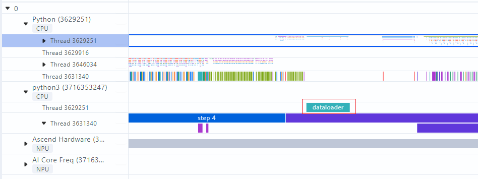

# mstx_torch_plugin

Ascend Pytorch Profiler中的[采集并解析msprof_tx数据](https://www.hiascend.com/document/detail/zh/canncommercial/80RC3/devaids/devtools/profiling/atlasprofiling_16_0033.html#ZH-CN_TOPIC_0000002081898541__section5940122172516)功能已经内置了通信算子的打点。为了方便用户在不修改业务代码的基础上获取更多关键阶段的耗时数据，mstx_torch_plugin在Ascend Pytorch Profiler内置了**dataloader**、**forward**、**step**、**save_checkpoint**这四个关键阶段函数的打点。

## 约束

暂不支持PyTorch图模式场景使用。

## 使用指导

1. 下载mstx_torch_plugin的whl包。

   请通过下表链接下载mstx_torch_plugin的whl包。

   | 版本 | 发布日期   | 下载链接                                                     | 校验码                                                       |
   | ---- | ---------- | ------------------------------------------------------------ | ------------------------------------------------------------ |
   | 1.0  | 2024-12-19 | [mstx_torch_plugin-1.0-py3-none-any.whl](https://ptdbg.obs.myhuaweicloud.com/profiler/example/1.0/mstx_torch_plugin-1.0-py3-none-any.whl) | 8b3500245ac0ea63f2ada832b1cc67ca8923a86d6081b165a8f62da0a276cbaa |

2. whl包校验。

   1. 根据以上下载链接下载whl包到Linux安装环境。

   2. 进入whl包所在目录，执行如下命令。

      ```
      sha256sum {name}.whl
      ```

      {name}为whl包名称。

      若回显呈现对应版本whl包一致的**校验码**，则表示下载了正确的性能工具whl安装包。示例如下：

      ```
      sha256sum mstx_torch_plugin-1.0-py3-none-any.whl
      xx *mstx_torch_plugin-1.0-py3-none-any.whl
      ```

3. 安装mstx_torch_plugin

   ```bash
   pip install mstx_torch_plugin-1.0-py3-none-any.whl
   ```

4. 在AI任务执行脚本中import导入该whl包。

   需保证import的顺序在import torch和import torch_npu后面：

   ```python
   import torch
   import torch_npu
   
   import mstx_torch_plugin
   ```

5. 使能torch_npu.profiler，采集打点数据。

   打开msprof_tx开关，profiler_level开关可根据实际采集需要，配置对应的level：

   ```python
   import torch
   import torch_npu
   
   import mstx_torch_plugin
   ...
   experimental_config = torch_npu.profiler._ExperimentalConfig(
   	export_type=torch_npu.profiler.ExportType.Text,
   	profiler_level=torch_npu.profiler.ProfilerLevel.Level_none
   )
   
   with torch_npu.profiler.profile(
   	activities=[
   		torch_npu.profiler.ProfilerActivity.CPU,
   		torch_npu.profiler.ProfilerActivity.NPU
   		],
   	schedule=torch_npu.profiler.schedule(wait=0, warmup=0, active=1, repeat=1, skip_first=1),
   	on_trace_ready=torch_npu.profiler.tensorboard_trace_handler("./result"),
   	experimental_config=experimental_config) as prof:
   		for step in range(steps):
   			train_one_step(step, steps, train_loader, model, optimizer, criterion)
   			prof.step()
   ```

## 采集结果

采集的性能数据使用MindStudio Insight工具打开，可视化效果如下：



上图以dataloader函数为例，与mstx数据相似，在上层应用数据中展示。
