# advisor

msprof-analyze的advisor功能是将Ascend PyTorch Profiler或者MindSpore Profiler采集的性能数据进行分析，并输出性能调优建议。

Ascend PyTorch Profilerf采集方法请参见《[性能调优工具](https://www.hiascend.com/document/detail/zh/mindstudio/81RC1/T&ITools/Profiling/atlasprofiling_16_0090.html)》，MindSpore Profiler采集方法请参见《[性能调试](https://www.mindspore.cn/mindinsight/docs/zh-CN/r2.3/performance_profiling_ascend.html)》。

## 工具使用（命令行方式方式）

### 约束

CANN软件版本8.0RC1之前仅支持对text格式文件分析，8.0RC1及之后支持text、db格式的采集数据分析。

### 操作步骤

1. 参见《[性能工具](../README.md)》完成工具安装。建议安装最新版本。

2. 执行分析。

   - 总体性能瓶颈

     ```bash
     msprof-analyze advisor all -d $HOME/profiling_data/
     ```

   - 计算瓶颈

     ```bash
     msprof-analyze advisor computation -d $HOME/profiling_data/
     ```

   - 调度瓶颈

     ```bash
     msprof-analyze advisor schedule -d $HOME/profiling_data/
     ```

   以上命令更多参数介绍请参见“**命令详解**”。

   单卡场景需要指定到性能数据文件`*_ascend_pt`或`*_ascend_ms`目录；多卡或集群场景需要指定到`*_ascend_pt`或`*_ascend_ms`目录的父目录层级。

3. 查看结果。

   分析结果输出相关简略建议到执行终端中，并生成`mstt_advisor_{timestamp}.html`和`mstt_advisor_{timestamp}.xlsx`文件供用户预览。
   
   `mstt_advisor_{timestamp}.xlsx`文件内容与执行终端输出一致。
   
   `mstt_advisor_{timestamp}.html`文件分析详见“**报告解析**”。
   
   执行终端输出示例如下：
   
   总体性能瓶颈
   
   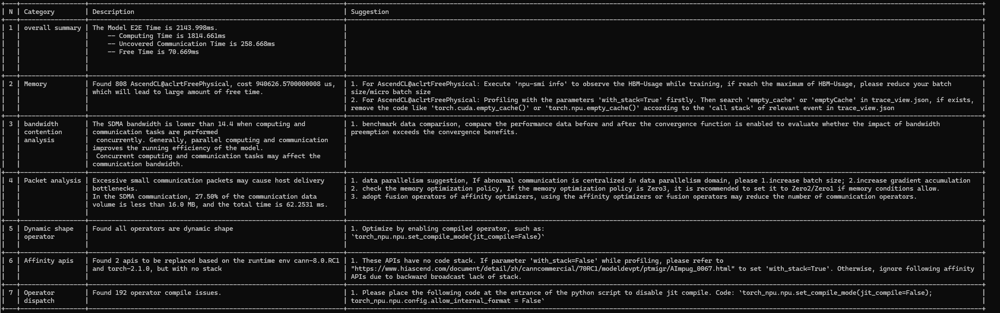
   
   计算瓶颈
   
   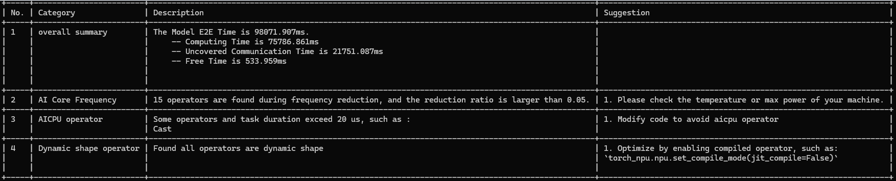
   
   调度瓶颈
   
   
   
   

### 命令详解

#### 命令功能介绍

msprof-analyze advisor命令行包含如下三个参数：

- all

  总体性能瓶颈：包含下表中所有功能。

- computation

  计算瓶颈：包含下表中computing和Kernel compare功能。

- schedule

  调度瓶颈：包含下表中scheduling和API compare功能。

下表中字段为advisor的完整功能点，由all、computation和schedule控制启动。

| dimension  | mode                                  | 参数释义                             | 支持场景                         |
| ---------- |---------------------------------------| ------------------------------------ | ------------------------------------ |
| overall    | Overall Summary                       | 计算、通信、空闲等维度对性能数据进行拆解 | PyTorch、MindSpore |
|            | Environment Variable Issues | 环境变量设置推荐             | PyTorch |
|     | slow rank                             | 慢卡识别                             | PyTorch、MindSpore            |
|            | slow link                             | 慢链路识别                           | PyTorch、MindSpore          |
| computation | AICPU Issues              | AI CPU调优                           | PyTorch、MindSpore          |
|            | Operator Dynamic Shape Issues | 识别动态Shape算子                    | PyTorch   |
| | AI Core Performance Analysis | MatMul、FlashAttentionScore、AI_VECTOR_CORE和MIX_AIV类算子的性能分析 | PyTorch |
|            | Block Dim Issues                   | Block Dim算子调优                    | PyTorch、MindSpore   |
|            | Operator No Bound Issues     | 算子瓶颈分析                | PyTorch、MindSpore |
|            | Fusion Issues                    | 融合算子图调优                        | PyTorch、MindSpore       |
|            | AI Core Frequency Issues | AI Core算子降频分析                  | PyTorch、MindSpore |
|communication| Packet Analysis                       |通信小包检测                          |PyTorch、MindSpore                          |
|| Bandwidth Contention Analysis |通信计算带宽抢占检测 |PyTorch、MindSpore |
|| Communication Retransmission Analysis |通信重传检测 |PyTorch、MindSpore |
|| Byte Alignment Analysis |通信算子字节对齐检测，传输类型为SDMA的通信算子，数据量需要被512字节整除，保证传输带宽不会下降 |PyTorch、MindSpore |
| schedule | Affinity API Issues     | 亲和API替换调优                      | PyTorch、MindSpore     |
|            | Operator Dispatch Issues   | 识别算子下发问题(路径3/路径5)            | PyTorch |
| | SyncBatchNorm Issues | BatchNorm同步检测 | PyTorch、MindSpore |
| | Synchronize Stream Issues | 流同步检测 | PyTorch、MindSpore |
| | GC Analysis | 识别异常垃圾回收事件。需要Ascend PyTorch Profiler采集时开启experimental_config下的gc_delect_threshold功能 | PyTorch |
| | Fusible Operator Analysis | 检测具有Host瓶颈或者MTE瓶颈的算子序列，可用于代码优化或开发可融合算子 | PyTorch、MindSpore |
| dataloader | Slow Dataloader Issues | 异常dataloader检测 | PyTorch、MindSpore |
| memory | Memory Operator Issues | 识别异常的内存申请释放操作 | PyTorch、MindSpore |
| comparison | Kernel compare of Rank\* Step\* and Rank\* Step\* | 识别标杆和待比对性能数据的Kernel数据（无标杆场景是集群内部快慢卡的性能数据对比，有标杆场景是两个集群之间存在明显耗时差异的相同卡之间的性能数据对比） | PyTorch、MindSpore |
|  | Api compare of Rank\* Step\* and Rank\* Step\* | 识别标杆和待比对性能数据的API数据（无标杆场景是集群内部快慢卡的性能数据对比，有标杆场景是两个集群之间存在明显耗时差异的相同卡之间的性能数据对比） | PyTorch |

集群场景时自动进行cluster和overall的environment_variable_analysis解析，单卡时自动进行overall解析。

#### 命令格式

- 总体性能瓶颈

  ```bash
  msprof-analyze advisor all -d {profiling_path} [-bp benchmark_profiling_path] [-o output_path] [-cv cann_version] [-tv torch_version] [-pt profiling_type] [--force] [--language language] [--debug] [-h]
  ```

- 计算瓶颈

  ```bash
  msprof-analyze advisor computation -d {profiling_path} [-o output_path] [-cv cann_version] [-tv torch_version] [-pt profiling_type] [--force] [--language language] [--debug] [-h]
  ```

- 调度瓶颈

  ```bash
  msprof-analyze advisor schedule -d {profiling_path} [-o output_path] [-cv cann_version] [-tv torch_version] [--force] [--language language] [--debug] [-h]
  ```

#### 参数介绍

| 参数                               | 说明                                                         | 是否必选 |
| ---------------------------------- | ------------------------------------------------------------ | -------- |
| -d<br>--profiling_path             | 性能数据文件或目录所在路径，Ascend PyTorch Profiler采集场景指定为`*_ascend_pt`性能数据结果目录，MindSpore Profiler采集场景指定为`*_ascend_ms`性能数据结果目录。集群数据需要指定到`*_ascend_pt`或`*_ascend_ms`的父目录。 | 是       |
| -bp<br/>--benchmark_profiling_path | 基准性能数据所在目录，用于性能比对。性能数据通过Profiling工具采集获取。<br>**computation和schedule不支持该参数。** | 否       |
| -o<br/>--output_path               | 分析结果输出路径，完成advisor分析操作后会在该目录下保存分析结果数据。默认未配置，为当前目录。 | 否       |
| -cv<br/>--cann_version             | 使用Profiling工具采集时对应的CANN软件版本。目前配套的兼容版本为“6.3.RC2”，“7.0.RC1”、“7.0.0”、“8.0.RC1”，此字段不填默认按“8.0.RC1”版本数据进行处理，其余版本采集的Profiling数据在分析时可能会导致不可知问题。可通过在环境中执行如下命令获取其version字段：`cat /usr/local/Ascend/ascend-toolkit/latest/aarch64-linux/ascend_toolkit_install.info` | 否       |
| -tv<br/>--torch_version            | 运行环境的torch版本，默认为1.11.0，支持torch1.11.0和torch2.1.0，当运行环境torch版本为其他版本如torch1.11.3时，可以忽略小版本号差异选择相近的torch版本如1.11.0。 | 否       |
| -pt<br/>--profiling_type           | 配置性能数据采集使用的Profiling工具类型。可取值：<br>        pytorch：使用Ascend PyThon Profiler接口方式采集的性能数据时配置，默认值。<br/>        mindspore：使用MindSpore Profiler接口方式采集的性能数据时配置。<br/>        mslite：使用[Benchmark](https://gitee.com/ascend/tools/tree/master/ais-bench_workload/tool/ais_bench)工具采集的性能数据时配置。不建议使用。<br>**schedule不支持该参数。** | 否       |
| --force                            | 强制执行advisor。配置后可强制跳过如下情况：<br/>        指定的目录、文件的用户属主不属于当前用户，忽略属主判断直接执行。<br/>        csv文件大于5G、json文件大于10G、db文件大于8G，忽略文件过大判断直接执行。<br/>配置该参数表示开启强制执行，默认未配置表示关闭。 | 否       |
| -l<br/>--language                  | 设置分析结果输出的语言，可取值：<br/>        cn：输出中文，默认值。<br/>        en：输出英文。 | 否       |
| --debug                            | 工具执行报错时可打开此开关，将会展示详细保存堆栈信息。配置该参数表示开启Debug，默认未配置表示关闭。 | 否       |
| -h，-H<br/>--help                  | 在需要查询当前命令附属子命令或相关参数时，给出帮助建议。     | 否       |

### 报告解析（无标杆）

无标杆是指执行msprof-analyze advisor时，未配置-bp参数，会根据性能数据中的computing time和free time判断是否进行kernel和API性能数据的对比，以慢卡数据为标杆数据，快卡数据为待比对数据。

如下图所示，工具会从集群、单卡性能拆解、调度和计算等维度进行问题诊断并给出相应的调优建议。并通过红、黄、绿色块表示问题优先级，分别为High（高）、Medium（中）、Low（低）。

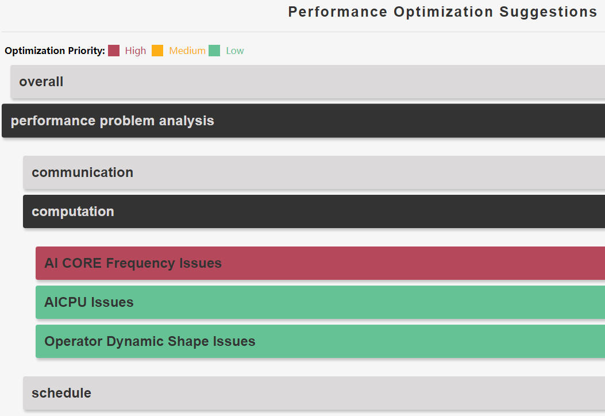

#### overall模块的分析

overall模块仅识别问题，不提供调优建议。

- 无标杆单卡场景的overall模块的Environment Variable Issues是对环境变量的设置做出推荐。

  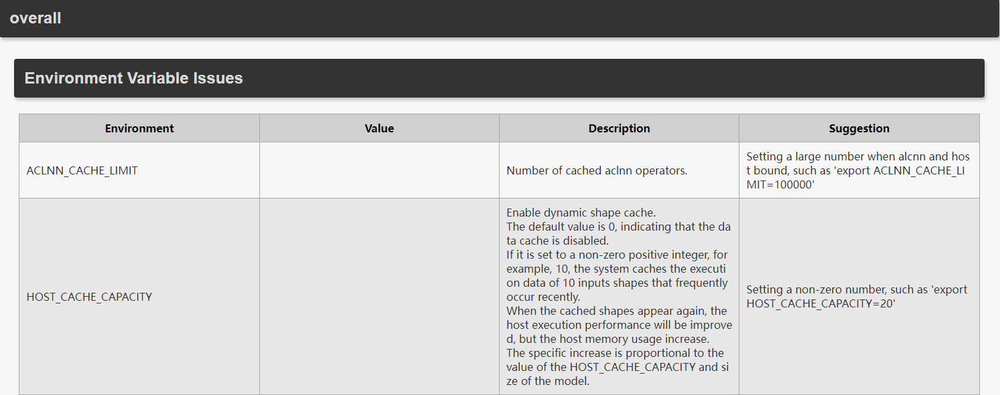

  上图中的环境变量详细介绍请参见[ACLNN_CACHE_LIMIT](https://www.hiascend.com/document/detail/zh/canncommercial/80RC22/apiref/envvar/envref_07_0031.html)和[HOST_CACHE_CAPACITY](https://www.hiascend.com/document/detail/zh/canncommercial/80RC22/developmentguide/appdevg/aclpythondevg/aclpythondevg_0045.html)。

- 无标杆单卡场景的overall模块的overall summary分析包含当前训练任务慢卡的性能拆解，按照计算、通信和下发三个维度进行耗时的统计，可以基于该分析识别到训练性能瓶颈是计算、通信还是下发问题，同样不提供调优建议。

  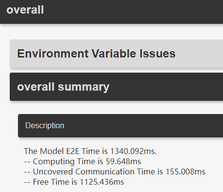

  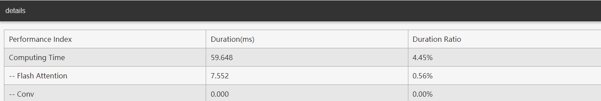

- 无标杆集群场景的overall模块包含快慢卡和快慢链路分析。

  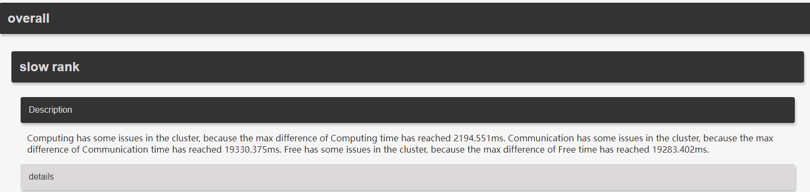

  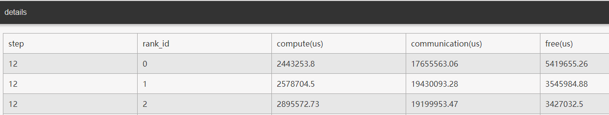

  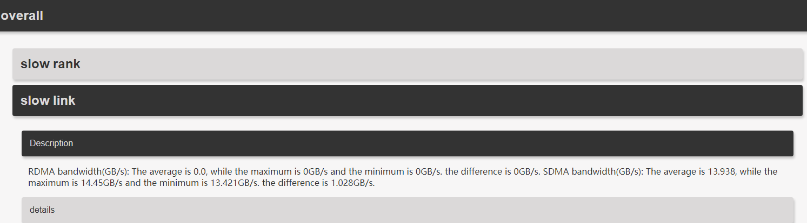

  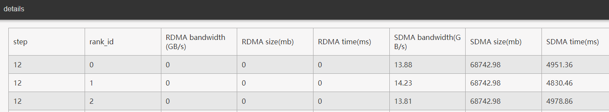

#### comparison

comparison模块内容如下图示例，识别标杆和待比对性能数据的Kernel和API数据，无标杆场景的comparison是集群内部快慢卡的性能数据对比。包括：

- Kernel compare of Rank* Step* and Rank* Step*：Kernel的待比对总耗时、待比对平均耗时、待比对最大耗时、待比对最小耗时和待比对执行次数，以及标杆的对应数据，最后计算Diff Total Ratio（标杆总耗时/待比对总耗时）和Diff Avg Ratio（标杆平均耗时/待比对平均耗时）。

  Diff Total Ratio和Diff Avg Ratio大于1则表示当前环境性能更优，小于1则表示当前环境有待优化，等于1则表示当前环境与标杆环境性能接近。

  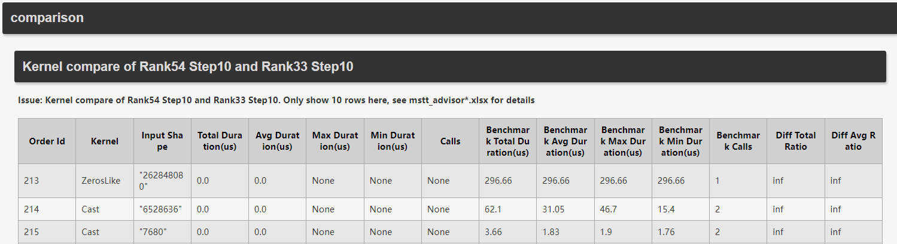

  其中inf表示分母为0（未获取到待对比数据或待对比数据为0），None表示未获取到数据。

- Api compare of Rank* Step* and Rank* Step*：API的待比对总耗时、待比对API自身耗时（除去API调用的子API的耗时）、待比对平均耗时和待比对执行次数，以及标杆的对应数据，最后计算Diff Total Ratio（标杆总耗时/待比对总耗时）、Diff Self Ratio（标杆API自身耗时/待比对API自身耗时）、Diff Avg Ratio（标杆平均耗时/待比对平均耗时）和Diff Calls Ratio（标杆执行次数/待比对执行次数）。

  Diff Total Ratio、Diff Self Ratio、Diff Avg Ratio和Diff Calls Ratio大于1则表示当前环境性能更优，小于1则表示当前环境有待优化，等于1则表示当前环境与标杆环境性能接近。

  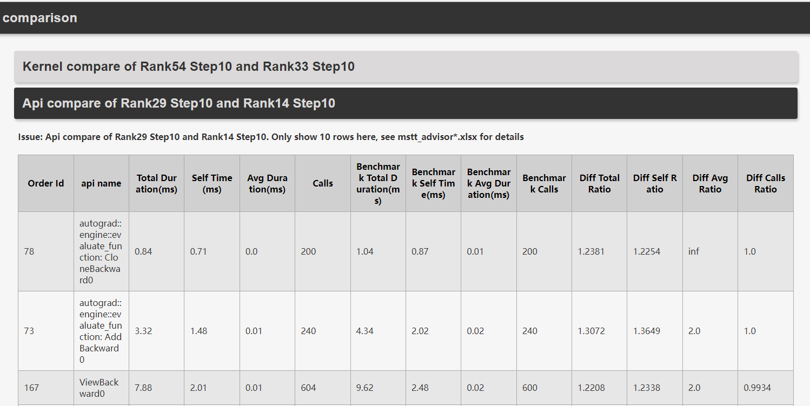
  
  其中inf表示分母为0（未获取到待对比数据或待对比数据为0），None表示未获取到数据。

`mstt_advisor_{timestamp}.html`文件的comparison模块内容仅展示Kernel和API的Top 10条数据，详细数据需要查看`mstt_advisor_{timestamp}.xlsx`文件。

#### performance problem analysis模块的分析

performance problem analysis模块包含如下子模块。

memory模块分析内存的异常申请释放操作。

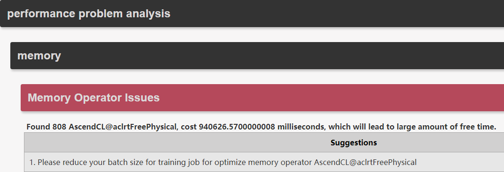

communication模块从通信维度进行分析，目前支持通信小包检测、通信计算带宽抢占检测、通信重传检测、通信算子字节对齐检测。

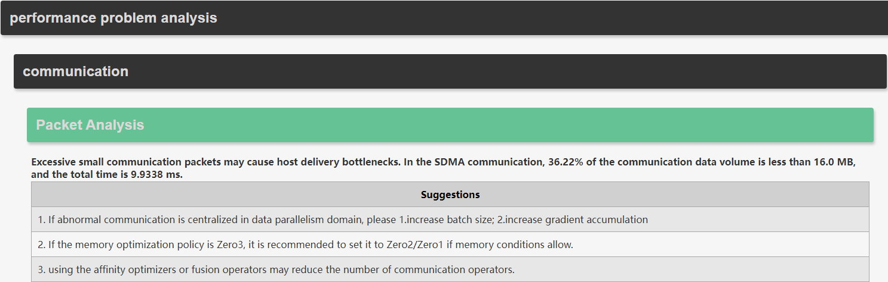

上图中Zero1/Zero2/Zero3含义如下：

- Zero1：每张NPU存储完整的一份梯度和模型参数，只有1/N优化器。每张NPU使用各自的数据做前向传播、反向传播，反向传播后使用all-reduce同步梯度到所有卡，使得每张卡有所有算子的梯度。每张卡根据梯度和1/N优化器更新1/N模型参数，再使用all-gather通信将优化器更新后的1/N模型参数发送给其它卡，因为每张卡有完整的一份模型参数需要更新。
- Zero2：每张NPU存储完整的一份模型参数，只有1/N优化器和1/N梯度。每张NPU使用各自的数据做前向传播。反向传播后，计算出本卡的局部梯度，使用Reduce-Scatter通信聚合梯度，保证每张卡只保存1/N梯度。每张卡根据自己保持的1/N优化器和1/N梯度更新1/N模型参数，再使用all-gather通信将更新后的模型参数发送给其它卡，因为每张卡有完整的一份模型参数需要更新。
- Zero3：每张NPU存储1/N模型参数、1/N优化器和1/N梯度。前向传播前，每张卡all-gather通信获取到完整的模型参数，再做前向传播计算，每用完一部分模型参数后就把它删除。反向传播开始前，每张卡all-gather通信获取到完整的模型参数，每用完一部分模型参数后就把它删除。使用reduce-scatter通信聚合梯度。每张卡根据自己保持的1/N优化器和1/N梯度更新1/N模型参数，由于每张卡只保存1/N模型参数，无需要将更新后的模型参数发送给其它卡。

通信重传检测分析，识别发生重传的通信域并提供调优建议。

如下图所示，识别到当前训练任务存在通信重传问题，并提供调优建议。

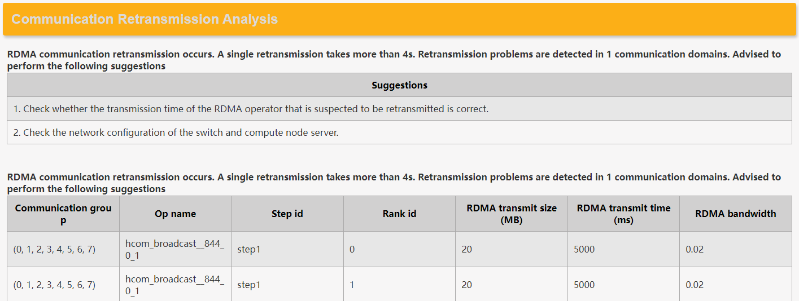

带宽抢占分析，检测计算和通信并发时，通信带宽被抢占的场景。

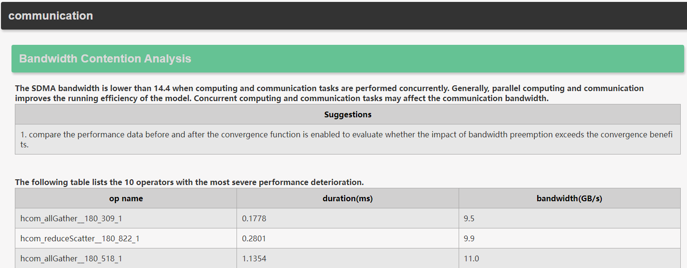

通信算子字节对齐检测，传输类型为SDMA的通信算子，数据量需要被512字节整除，保证传输带宽不会下降。

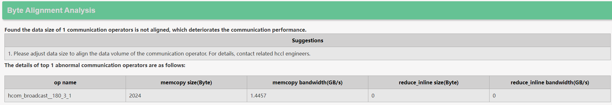

computation模块从device计算性能维度进行分析，能够识别AI CPU、动态Shape、AI Core Performance Analysis、Dlock Dim、算子瓶颈、融合算子图、AI Core算子降频分析等问题并给出相应建议。此处不再详细展开，按照报告进行调优即可。示例如下：

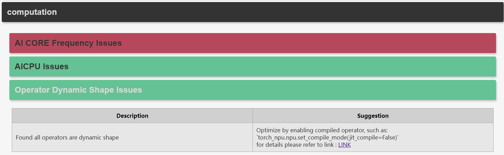

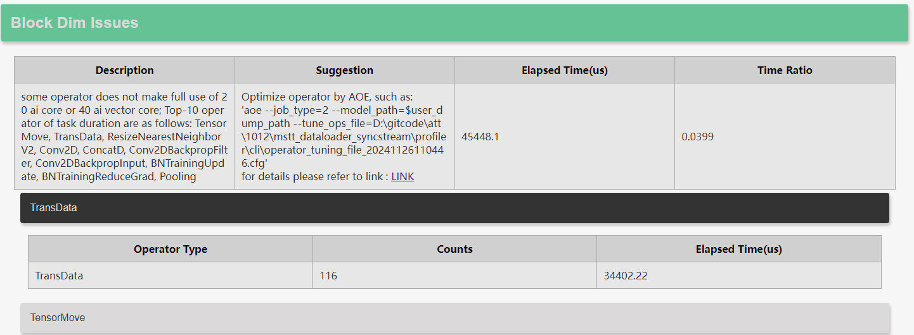

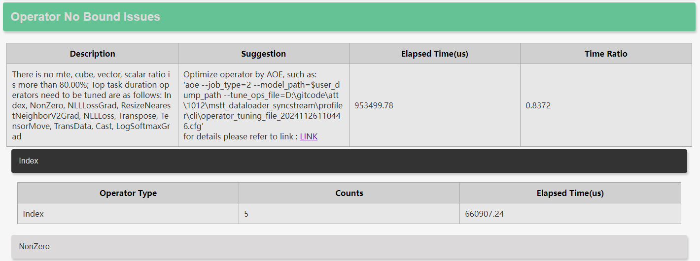

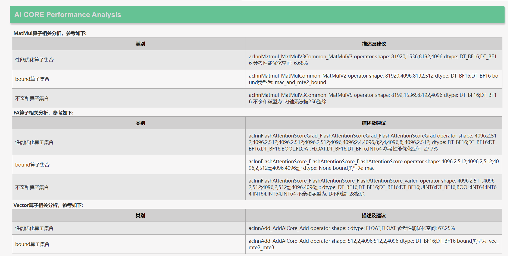

上图中torch_npu.npu.set_compile_mode接口介绍请参见[torch_npu.npu.set_compile_mode](https://www.hiascend.com/document/detail/zh/Pytorch/60RC2/apiref/apilist/ptaoplist_000880.html)；AICPU算子替换样例可参考《[Samples of AI CPU Operator Replacement](https://gitee.com/ascend/mstt/blob/master/profiler/msprof_analyze/advisor/doc/Samples%20of%20AI%20CPU%20Operator%20Replacement.md)》。

当存在pp stage（流水线并行）时，computation会按stage分析，每个stage就是一个流水线切分，比如0\~7卡为stage-0、8\~15卡为stage-1。

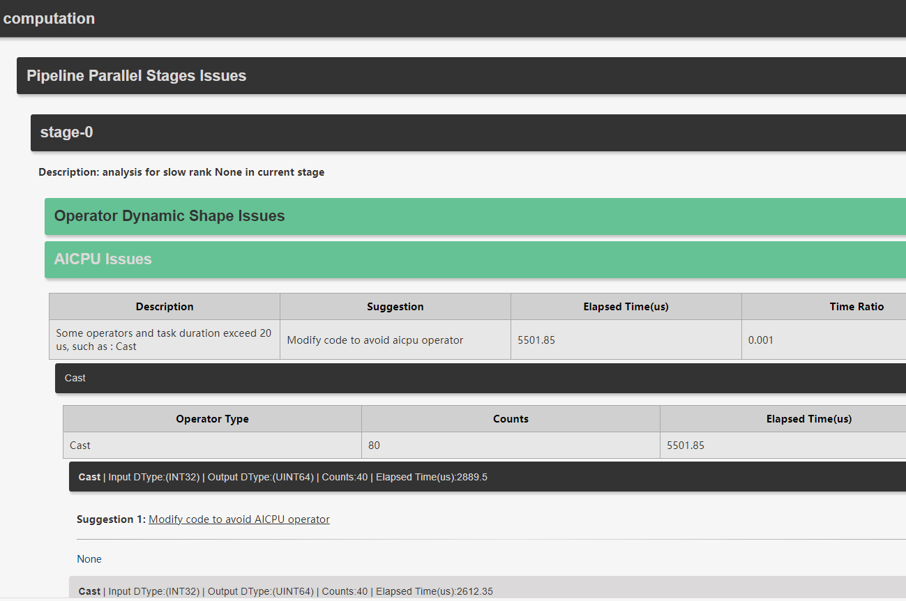

dataloader模块包含Slow Dataloader Issues，主要检测异常高耗时的dataloader调用，并给出优化建议。

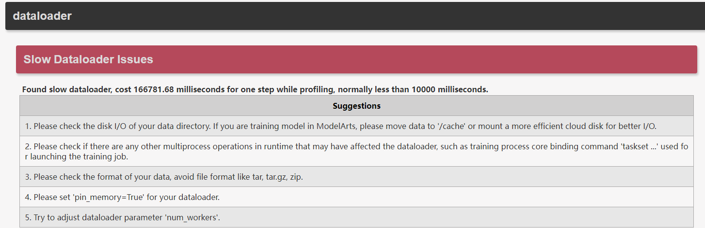

上图中的`pin_memory`（内存锁定）和`num_workers`（数据加载是子流程数量）参数为[数据加载优化](https://www.hiascend.com/document/detail/zh/Pytorch/60RC2/ptmoddevg/trainingmigrguide/performance_tuning_0019.html)使用。

schedule模块包含GC Analysis、亲和API、aclOpCompile、SyncBatchNorm、SynchronizeStream和Fusible Operator Analysis等多项检测。

其中Fusible Operator Analysis解析结果仅打屏展示和保存在`mstt_advisor_{timestamp}.xlsx`文件中，包含“基于host瓶颈的算子序列分析”和“基于mte瓶颈的算子序列分析”页签，如下图：

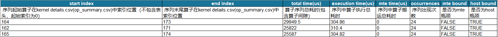

| 字段               | 说明                                                         |
| ------------------ | ------------------------------------------------------------ |
| start index        | 序列起始算子在kernel details.csv或op_summary.csv中索引位置（不包含表头，起始索引为0）。 |
| end index          | 序列末尾算子在kernel details.csv或op_summary.csv中索引位置。 |
| total time(us)     | 算子序列总耗时（包含算子间隙），单位us。                     |
| execution time(us) | 序列中算子执行总耗时，单位us。                               |
| mte time(us)       | 序列中算子搬运总耗时，单位us。                               |
| occurrences        | 序列出现次数。                                               |
| mte bound          | 是否为MTE瓶颈。                                              |
| host bound         | 是否为Host瓶颈。                                             |

如下图示例，GC Analysis提示存在异常垃圾回收事件，用户可以通过有效的Python内存管理、使用`gc.set_threshold()`调整垃圾回收阈值、使用gc.disable()禁用gc等方法处理GC问题。

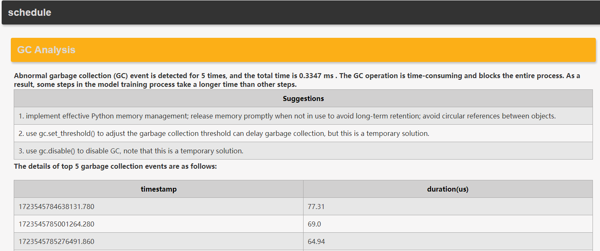

上图中`gc.set_threshold()`和`gc.disable()`函数说明如下：

在Python中，gc模块提供了对垃圾回收器的控制。

- `gc.set_threshold(threshold0, thresholdl, threshold2)`：这个函数用于设置垃圾回收的阈值。垃圾回收器将所有对象分为三代（0代、1代和2代），每一代的对象在经历垃圾回收后会被移到下一代。`threshold0`控制第0代的垃圾回收频率，`threshold1`控制第1代的垃圾回收频率，`threshold2`控制第2代的垃圾回收频率。将`threshold0`设为0可以禁用垃圾回收。
- `gc.disable ()`：这个函数用于禁用自动垃圾回收。调用`gc.disable ()`后，垃圾回收器将不会自动运行，直到手动调用`gc.enable（）`。

如下图示例，Affinity API Issues提示存在可以替换的亲和API并给出对应的堆栈，用户可以根据堆栈找到需要修改的代码，并给出修改案例（[API instructions](https://gitee.com/ascend/mstt/blob/master/profiler/msprof_analyze/advisor/doc/Samples%20of%20Fused%20Operator%20API%20Replacement.md)）。

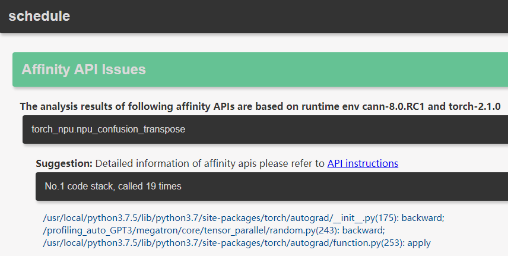

如下图示例，Synchronize Stream Issues提示存在耗时较多的同步流，并给出触发同步流的堆栈，需要根据堆栈来修改对应代码消除同步流。

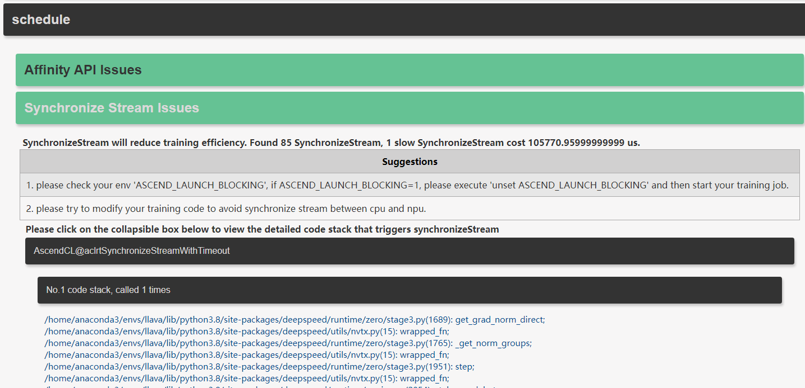

上图中的ASCEND_LAUNCH_BLOCKING环境变量介绍请参见[ASCEND_LAUNCH_BLOCKING](https://www.hiascend.com/document/detail/zh/canncommercial/80RC22/apiref/envvar/envref_07_0050.html)。

如下图示例，Operator Dispatch Issues提示需要在运行脚本的最开头添加如下代码用于消除aclOpCompile：

```python
torch_npu.npu.set_compile_mode(jit_compile=False);
torch_npu.npu.config.allow_internal_format = False
```

以上接口介绍请参见[torch_npu.npu.set_compile_mode](https://www.hiascend.com/document/detail/zh/Pytorch/60RC2/apiref/apilist/ptaoplist_000880.html)和[torch_npu.npu.config.allow_internal_format](https://www.hiascend.com/document/detail/zh/Pytorch/60RC2/apiref/apilist/ptaoplist_000216.html)。

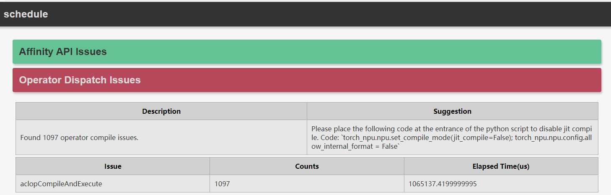

上图中aclopCompileAndExecute接口介绍请参见[aclopCompileAndExecute](https://www.hiascend.com/document/detail/zh/canncommercial/80RC22/apiref/appdevgapi/aclcppdevg_03_0243.html)。

### 报告解析（有标杆）

有标杆是指执行msprof-analyze advisor时，配置-bp参数，指定基准性能数据进行比对。

有标杆单卡场景：不进行overall模块的分析，performance problem analysis模块与有标杆场景下的performance problem analysis模块结果一致。

有标杆集群场景：

- overall模块进行快慢卡和快慢链路分析，与无标杆集群场景一致，请参见“**报告解析（无标杆）** > **overall模块的分析**”。
- 提供Environment Variable Issues，与无标杆单卡场景一致，请参见“**报告解析（无标杆）** > **overall模块的分析**”。
- 有标杆集群场景同样提供comparison模块（无标杆场景是集群内部快慢卡的性能数据对比，有标杆场景是两个集群之间存在明显耗时差异的相同卡之间的性能数据对比）。

comparison模块内容如下图示例，识别标杆和待比对性能数据的Kernel和API数据，包括：

- Kernel compare of Target and Benchmark：Kernel的待比对总耗时、待比对平均耗时、待比对最大耗时、待比对最小耗时和待比对执行次数，以及标杆的对应数据，最后计算Diff Total Ratio（标杆总耗时/待比对总耗时）和Diff Avg Ratio（标杆平均耗时/待比对平均耗时）。

  Diff Total Ratio和Diff Avg Ratio大于1则表示当前环境性能更优，小于1则表示当前环境有待优化，等于1则表示当前环境与标杆环境性能接近。

  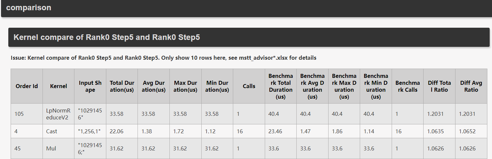

  其中inf表示分母为0（未获取到待对比数据或待对比数据为0），None表示未获取到数据。

- Api compare of Target and Benchmark：API的待比对总耗时、待比对API自身耗时（除去API调用的子API的耗时）、待比对平均耗时和待比对执行次数，以及标杆的对应数据，最后计算Diff Total Ratio（标杆总耗时/待比对总耗时）、Diff Self Ratio（标杆API自身耗时/待比对API自身耗时）、Diff Avg Ratio（标杆平均耗时/待比对平均耗时）和Diff Calls Ratio（标杆执行次数/待比对执行次数）。

  Diff Total Ratio、Diff Self Ratio、Diff Avg Ratio和Diff Calls Ratio大于1则表示当前环境性能更优，小于1则表示当前环境有待优化，等于1则表示当前环境与标杆环境性能接近。

  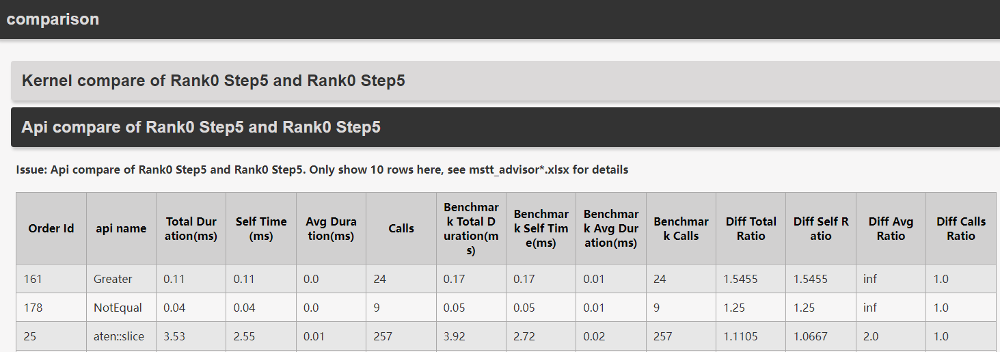
  
  其中inf表示分母为0（未获取到待对比数据或待对比数据为0），None表示未获取到数据。

`mstt_advisor_{timestamp}.html`文件的comparison模块内容仅展示Kernel和API的Top 10条数据，详细数据需要查看`mstt_advisor_{timestamp}.xlsx`文件。

## 工具使用（Jupyter Notebook方式）

MindSpore场景不支持该方式。

Jupyter Notebook使用方式如下：

下列以Windows环境下执行为例介绍。

1. 在环境下安装Jupyter Notebook工具。

   ```bash
   pip install jupyter notebook
   ```

   Jupyter Notebook工具的具体安装和使用指导请至Jupyter Notebook工具官网查找。

2. 在环境下安装mstt工具。

   ```
   git clone https://gitee.com/ascend/mstt.git
   ```

   安装环境下保存Ascend PyTorch Profiler采集的性能数据。

3. 进入mstt\profiler\msprof_analyze\advisor目录执行如下命令启动Jupyter Notebook工具。

   ```bash
   jupyter notebook
   ```

   执行成功则自动启动浏览器读取mstt\profiler\msprof_analyze\advisor目录，如下示例：

   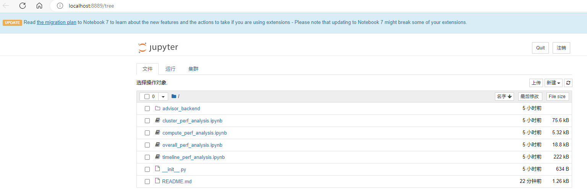

   若在Linux环境下则回显打印URL地址，即是打开Jupyter Notebook工具页面的地址，需要复制URL，并使用浏览器访问（若为远端服务器则需要将域名“**localhost**”替换为远端服务器的IP），进入Jupyter Notebook工具页面。

4. 每个.ipynb文件为一项性能数据分析任务，选择需要的.ipynb打开，并在*_path参数下拷贝保存Ascend PyTorch Profiler采集的性能数据的路径。如下示例：

   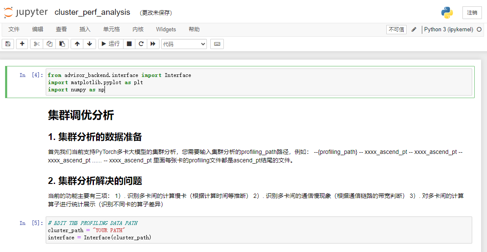

5. 单击运行按钮执行性能数据分析。

   分析结果详细内容会在.ipynb页面下展示。
