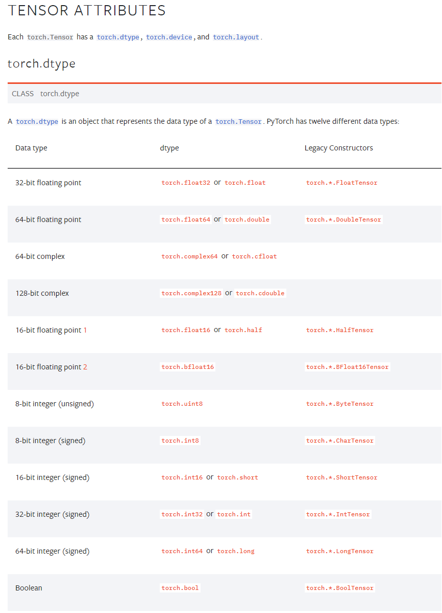
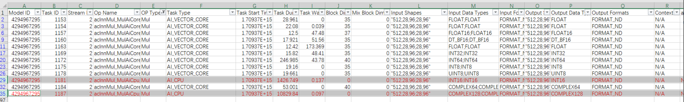
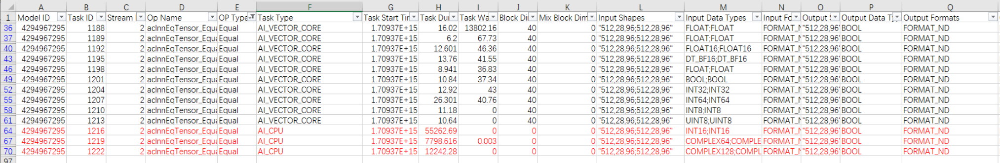
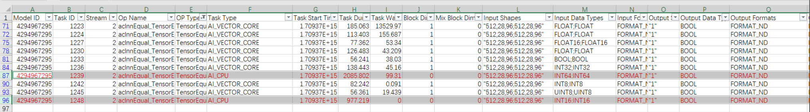
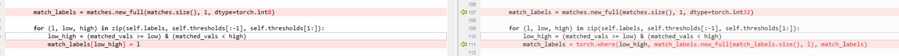
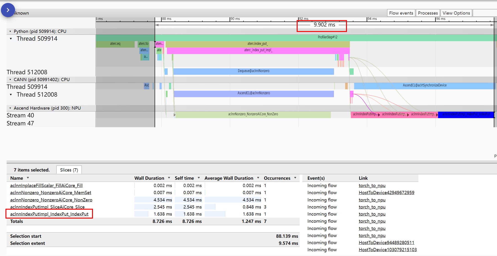
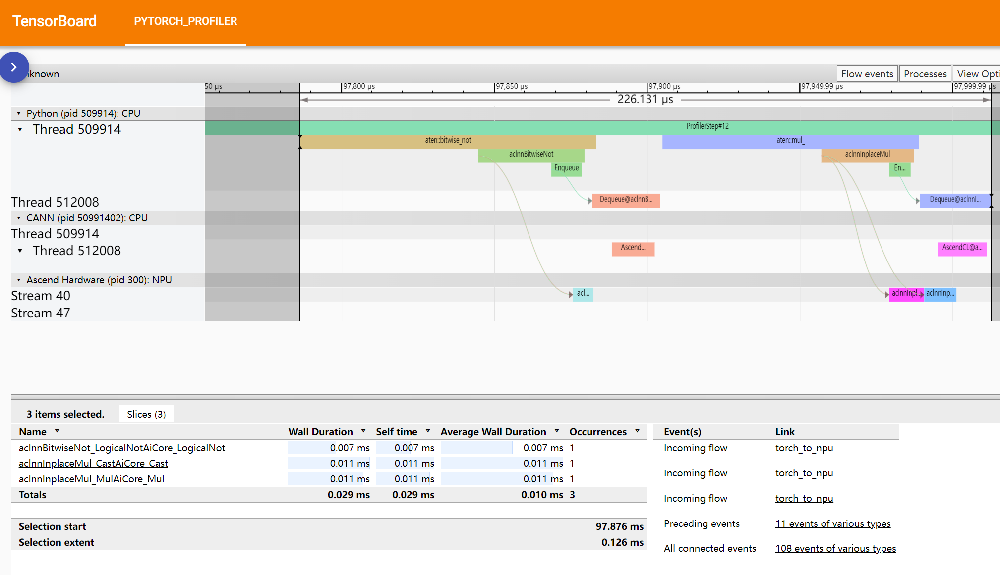
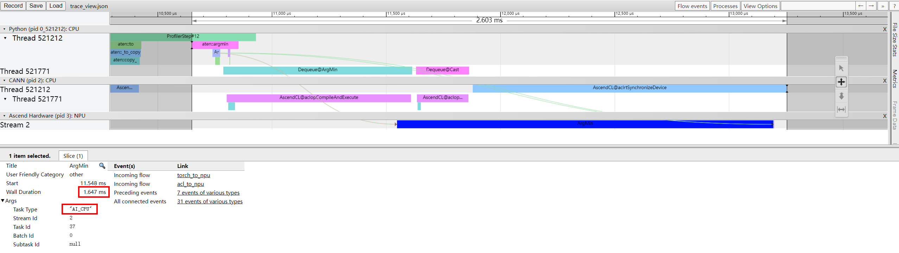
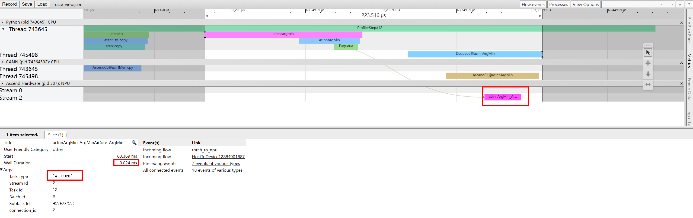

# AI CPU 算子替换样例

部分算子因为数据输入类型问题或者算子实现问题，导致会在昇腾芯片的AI CPU上执行，没有充分利用AI CORE的资源，从而导致计算性能较差，影响训练速度。部分场景下，可以通过修改Python代码来减少这类AI CPU算子，从而提升训练性能。

当前对 AICPU 算子识别到的调优方式主要包含两种：

- PyTorch数据类型转换，将执行在AICPU上的类型算子转换为执行在AICORE单元的算子。
- 等价的算子替换。

## 类型转换方式

当前PyTorch支持的dtype类型如下，详见[Link](https://pytorch.org/docs/stable/tensor_attributes.html)。

图1 PyTorch支持的dtype



基于此对常见的算子如MUL、Equal、TensorEqual等做单算子测试，看有哪些类型的算子是执行在AICPU上的，然后尝试转换到支持AICORE单元的类型dtype上计算，实现效率提升的目的。

### MUL

图2 Mul



AICORE支持的dtype。

```python
float, float32, float16, dt_bf16, int32, int64, int8, uint8, complex64
```

AICPU 类型的 dtype。

```python
int16, complex128 
```

### Equal

图3 Equal



AICORE支持的dtype。

```python
float, float32, float16, dt_bf16, bool, int32, int64, int8, uint81 
```

AICPU 类型的 dtype。

```python
int16, complex64, complex128
```

### TensorEqual

图4 TensorEqual



AICORE支持的dtype。

```python
float, float32, float16, dt_bf16, float64, bool, int32, int8, uint81 
```

AICPU 类型的 dtype。

```python
int16, int64
```

## 算子等价替换

### Index算子替换

- 情形一 ：index by index

  这种操作会造成输出的shape和输入的shape不一致，我们可以直接用index\_select(gatherV2)操作替换该算子运行在aicore性能高上很多。

  图5 index by index

  

- 情形二：index\_put by index

  ```python
  tensor[index] = 3
  ```

  这类操作尽量避免，没有特别好的替代方式，可以将index转化成mask，或者一开始就生成mask作为索引而不是index。

  如果要替换可以用scatter算子替换，目前发现用到这种场景时index一般比较少，所以用index方式可能性能更高。

- 情形三：index\_put by mask

  ```python
  tensor\_a[mask] = 3
  ```

  index\_put by mask可以通过where (selectV2)算子来替代。这种方式与原先语义不同的是，会返回一个新的tensor。

  图6 index\_put by mask
  
  
  
  index by mask或者index_put by mask相对来说对NPU和框架比较友好。关键在保持shape这样不需要contiguous，然后将必要的index抽取操作放在最后。在index比较少的情况下，index操作就比较快了，可能优于替换。

### IndexPut算子替换

在tensor类型的赋值和切片操作时，会使用IndexPut算子执行，一般都在AICPU上执行，可以转换为等价的tensor操作转换到CUBE单元上执行。例如：

```python
masked_input[input_mask] = 0
```

建议替换为：

```python
masked_input *= ~input_mask
```

此处是将IndexPut的masked_input是float类型的tensor数据，input_mask是和masked_input shape 一致的bool类型tensor或者01矩阵。由于是赋0操作，所以先对input_mask 取反后再进行乘法操作。

以赋0操作为例，在shape = (512, 32, 64) 类型float32 数据上测试，替换前耗时: 9.639978408813477 ms，替换之后耗时为 0.1747608184814453 ms，如下图，替换前，总体耗时在9.902ms，Host下发到device侧执行5个算子，其中aclnnIndexPutImpl_IndexPut_IndexPut是执行在 AICPU上。

图7 替换前耗时



替换后，总体耗时226.131us。下发三个执行算子，均执行在AI CORE上。

图8 替换后耗时



### ArgMin算子优化

ArgMin在CANN 6.3 RC2版本上算子下发到 AICPU执行，在CANN 7.0RC1上下发到AI_CORE 上边执行。出现此类情形建议升级CANN包版本。

在shape大小是 (1024, 1024) 的tensor上测试，结果如下：CANN 6.3.RC2上，单算子执行时间 2.603 ms。

图9 单算子执行时间（CANN 6.3.RC2）



CANN7.0 RC1上，单算子执行时间 223.516 us。

图10 单算子执行时间（CANN7.0 RC1）



### nonzero算子优化

将mask转化为index，对于所有值大于0的tensor在某些计算中可以利用乘法替代。比如要对mask的tensor求和。tensor_a[mask].sum()就相当于(tensor_a * mask).sum()。

例如：

```python
shape = (1024, )
mask= torch.randint(-1, 2, shape).npu()
tensor_a = torch.ones(shape).float().npu()
mask_inds = torch.nonzero(
        gt_inds > 0, as_tuple=False).squeeze(1)

tensor_sum = tensor_a[mask_inds].sum()
```

就相当于：

```python
shape = (1024, ) 
mask= torch.randint(-1, 2, shape).npu() 
tensor_a = torch.ones(shape).float().npu() 
mask_inds = torch.nonzero( gt_inds > 0, as_tuple=False).squeeze(1)
tensor_sum2 = (tensor_a * mask_inds2).sum()
```