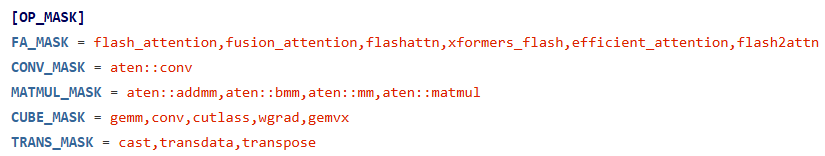
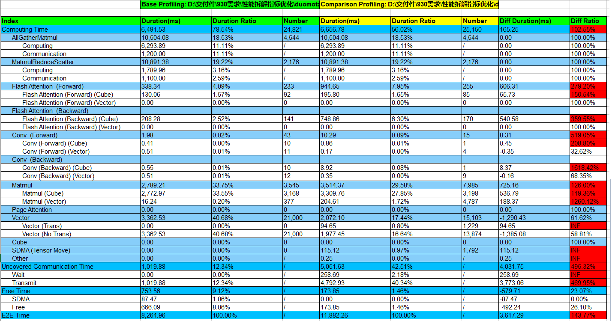

# 性能比对工具

compare_tools（性能比对工具）支持比较GPU与NPU之间、NPU与NPU之间的性能差异，通过对训练耗时和内存占用的比对分析，定位到具体劣化的算子，帮助用户提升性能调优的效率。工具将训练耗时拆分为计算、通信、调度三大维度，并针对计算和通信分别进行算子级别的比对；将训练占用的总内存，拆分成算子级别的内存占用进行比对。

## 使用场景

场景一：PyTorch训练工程从GPU迁移至NPU后出现性能劣化，通过工具分析出劣化点。

场景二：PyTorch或MindSpore训练工程在NPU上，不同版本之间存在性能差距，通过工具定位具体差异。

场景三：PyTorch训练工程从GPU迁移至MindSpore NPU后出现性能劣化，通过工具分析出劣化点。

## 使用指导

### 环境依赖

使用本工具前需要安装的依赖包：

```bash
pip3 install prettytable
pip3 install xlsxwriter
pip3 install pandas
pip3 install numpy
```

### PyTorch框架性能数据采集

使用本工具之前需要采集GPU或者NPU的性能数据，建议只采集一个step的性能数据，然后进行性能比对分析。

#### GPU性能数据采集

通过PyTorch Profiler工具采集GPU的性能数据，参考链接：[torch.profiler](https://pytorch.org/docs/stable/profiler.html)。

采集样例代码参考一：

```Python
with torch.profiler.profile(
        profile_memory=True,  # 内存数据采集的开关
        record_shapes=True,  # 算子input shape信息采集的开关
        schedule=torch.profiler.schedule(wait=10, warmup=0, active=1, repeat=1),
        on_trace_ready=torch.profiler.tensorboard_trace_handler("./result_dir")
) as prof:
    for step in range(step_number):
        train_one_step()
        prof.step()
```

采集样例代码参考二：

```Python
prof = torch.profiler.profile(
    profile_memory=True,  # 内存数据采集的开关
    record_shapes=True,  # 算子input shape信息采集的开关
    on_trace_ready=torch.profiler.tensorboard_trace_handler("./result_dir"))
for step in range(step_number):
    if step == 11:
        prof.start()
    train_one_step()
    if step == 11:
        prof.stop()
```

PyTorch Profiler采集结果数据目录结构如下：

```Python
|- pytorch_profiling
    |- *.pt.trace.json
```

#### NPU性能数据采集

通过Ascend PyTorch Profiler工具采集NPU的性能数据，采集参数配置与GPU基本一致，只需将GPU的性能数据采集代码中torch.profiler替换成torch_npu.profiler，参考链接：[NPU性能数据采集](https://gitee.com/ascend/mstt/tree/master/profiler/msprof_analyze#npu性能数据采集)。

Ascend PyTorch Profiler采集结果数据目录结构如下：

```bash
|- ascend_pytorch_profiling
    |- * _ascend_pt
        |- ASCEND_PROFILER_OUTPUT
            |- kernel_details.csv
            |- op_statistic.csv
            |- trace_view.json
        |- FRAMEWORK
        |- PROF_XXX
    |- * _ascend_pt
```

或

```bash
|- ascend_pytorch_profiling
    |- * _ascend_pt
        |- ASCEND_PROFILER_OUTPUT
            |- analysis.db
            |- ascend_pytorch_profiler_{rank_id}.db
        |- FRAMEWORK
        |- PROF_XXX
    |- * _ascend_pt
```

以上两种目录为Ascend PyTorch Profiler采集时设置export_type接口参数为Text和Db时的不同文件格式输出结果，可选择任意一种进行比对，若目录中同时包含以上两种文件，则按照export_type接口参数为Db的结果比对。

### MindSpore框架性能数据采集

#### NPU性能数据采集

当前MindSpore场景仅支持NPU环境性能数据与PyTorch GPU性能数据进行比对；以及MindSpore训练工程在NPU上，不同版本之间的性能数据进行比对。

通过MindSpore性能调试工具采集NPU的性能数据，建议只采集或只解析一个step的性能数据，参考链接：[性能调试（Ascend）](https://www.mindspore.cn/mindinsight/docs/zh-CN/r2.3/performance_profiling_ascend.html)。

MindSpore性能调试工具采集结果数据目录结构如下：

```bash
|- profiler/{rank-*}_{timestamps}_ascend_ms
   |- ASCEND_PROFILER_OUTPUT
      |- kernel_details.csv
      |- op_statistic.csv
      |- trace_view.json
```

或

```bash
|- profiler/{rank-*}_{timestamps}_ascend_ms
   |- ASCEND_PROFILER_OUTPUT
      |- analysis.db
      |- ascend_mindspore_profiler_{rank_id}.db
```

以上两种目录为MindSpore采集时设置export_type接口参数为Text和Db时的不同文件格式输出结果，可选择任意一种进行比对，若目录中同时包含以上两种文件，则按照export_type接口参数为Db的结果比对。

进行性能比对时，MindSpore采集的性能数据须指定到`profiler/{rank-*}_{timestamps}_ascend_ms`或`ASCEND_PROFILER_OUTPUT`层级。

### 性能数据比对

性能比对工具将总体性能拆解为训练耗时和内存占用，其中训练耗时可拆分为算子（包括算子和nn.Module）、通信、调度三个维度，以打屏的形式输出总体指标，帮助用户定界劣化的方向。与此同时，工具还会生成performance_comparison_result_{timestamp}.xlsx，展示每个算子在执行耗时、通信耗时、内存占用的优劣，可通过DIFF列大于0筛选出劣化算子。详细介绍请参见“**比对结果说明**”。

性能比对工具支持使用**命令行**和**脚本**两种方式执行性能数据比对操作，这两种方式均支持**通用参数**和**算子性能比对特有参数**。

#### 命令行方式

1. 参见《[性能工具](../README.md)》完成工具安装。

2. 执行如下命令进行性能数据比对：

   ```
   msprof-analyze compare -d [比对性能数据文件所在路径] -bp [基准性能数据文件所在路径] --output_path=[比对结果文件存放路径]
   ```

   - --profiling_path或-d（必选）：比对性能数据文件所在路径。可以指定以“ascend_pt”或“ascend_ms”结尾的目录、ASCEND_PROFILER_OUTPUT目录或trace_view.json文件，指定trace_view.json无法显示算子的内存占用。
   - --benchmark_profiling_path或-bp（必选）：基准性能数据文件所在路径。基准性能数据文件若以GPU为基准，指定到以“.pt.trace”结尾的json文件；若以NPU不同版本为基准，指定文件与-d一致。
   - --output_path或-o（可选）：性能比对结果存放的路径，默认保存在当前目录。

#### 脚本方式

将mstt代码仓下载到本地，执行如下命令：

```bash
# 进入mstt代码仓目录下的compare_tools目录
cd mstt/profiler/msprof_analyze/compare_tools
# 执行最简比对命令
python performance_compare.py [基准性能数据文件所在路径] [比对性能数据文件所在路径] --output_path=[比对结果文件存放路径]
```

- 基准性能数据文件所在路径（必选）：若以GPU为基准，指定到以".pt.trace"结尾的json文件；若以NPU不同版本为基准，指定文件参考**比对性能数据文件所在路径**。
- 比对性能数据文件所在路径（必选）：可以指定以“ascend_pt”或“ascend_ms”结尾的目录、ASCEND_PROFILER_OUTPUT目录或trace_view.json文件，指定trace_view.json无法显示算子的内存占用。
- --output_path或-o（可选）：性能比对结果存放的路径，默认保存在当前目录。

#### 通用参数说明

| 参数名                         | 说明                                                         | 是否必选 | torch_npu支持 | MindSpore支持 |
| ------------------------------ | ------------------------------------------------------------ | -------- | ------------- | ------------- |
| --enable_profiling_compare     | 开启总体性能比对。                                           | 否       | 是            | 是            |
| --enable_operator_compare      | 开启算子性能比对。该开关较耗时，建议只采集一个step的性能数据。支持扩展参数请参见“**算子性能比对特有参数说明**”。 | 否       | 是            | 否            |
| --enable_communication_compare | 开启通信性能比对。                                           | 否       | 是            | 是            |
| --enable_memory_compare        | 开启算子内存比对。该开关较耗时，建议只采集一个step的性能数据。 | 否       | 是            | 否            |
| --enable_kernel_compare        | 开启kernel性能比对。仅针对NPU与NPU比对的场景。支持扩展参数请参见“**kernel性能比对特有参数说明**”。 | 否       | 是            | 是            |
| --enable_api_compare           | 开启API性能比对。需要使用性能数据中的trace_view.csv文件。    | 否       | 是            | 否            |
| --disable_details              | 隐藏明细比对，只进行统计级比对。                             | 否       | 是            | 是            |
| --base_step                    | 基准性能数据step ID，配置后使用基准性能数据对应step的数据进行比对。为整数，需配置实际数据存在的step ID，默认未配置，比对所有性能数据，需要与--comparison_step同时配置。配置示例：--base_step=1。<br>**仅--enable_profiling_compare（仅Db数据）、--enable_operator_compare、--enable_communication_compare、--enable_memory_compare、--enable_kernel_compare或--enable_api_compare开启时，该参数配置生效。** | 否       | 是            | 是            |
| --comparison_step              | 比对性能数据step ID，配置后使用比对性能数据对应step的数据进行比对。为整数，需配置实际数据存在的step ID，默认未配置，比对所有性能数据，需要与--base_step同时配置。配置示例：--comparison_step=1。<br/>**仅--enable_profiling_compare（仅Db数据）、--enable_operator_compare、--enable_communication_compare、--enable_memory_compare、--enable_kernel_compare或--enable_api_compare开启时，该参数配置生效。** | 否       | 是            | 是            |
| --force                        | 强制执行compare。配置后可强制跳过如下情况：<br/>        指定的目录、文件的用户属主不属于当前用户，忽略属主判断直接执行。<br/>        csv文件大于5G、json文件大于10G、db文件大于8G，忽略文件过大判断直接执行。<br/>配置该参数表示开启强制执行，默认未配置表示关闭。 | 否       | 是            | 是            |
| --debug                        | 工具执行报错时可打开此开关，将会展示详细保存堆栈信息。配置该参数表示开启Debug，默认未配置表示关闭。 | 否       | 是            | 是            |
| -h，-H<br/>--help              | 在需要查询当前命令附属子命令或相关参数时，给出帮助建议。     | 否       | 是            | 是            |

说明：以上开关均不设置的情况下，**工具默认开启所有的性能比对**，当用户设置了以上开关，则按照用户设置的开关进行性能比对，示例如下：

```bash
msprof-analyze compare -d [比对性能数据文件所在路径] -bp [基准性能数据文件所在路径] --output_path=./result_dir --enable_profiling_compare
```

或

```bash
python performance_compare.py [基准性能数据文件] [比对性能数据文件] --output_path=./result_dir --enable_profiling_compare
```

此时表示仅开启总体性能比对。

#### 算子性能比对特有参数说明

--enable_operator_compare时支持。

| 参数名            | 说明                                                         | 是否必选 |
| ----------------- | ------------------------------------------------------------ | -------- |
| --gpu_flow_cat    | 配置GPU trace中CPU侧算子与device kernel的连线标识，当GPU的Device Duration(us)均为0时设置。使用chrome://tracing打开GPU的json，右上角Flow events找到连线标识，将标识配置进该参数。使用示例：--gpu_flow_cat=async_gpu | 否       |
| --use_input_shape | 开启算子精准匹配，默认关闭。使用示例：--use_input_shape      | 否       |
| --max_kernel_num  | 设置CPU侧算子下发的最大kernel数量，当超过设定值时工具会自动往下找子算子，直至满足条件。默认仅比对最上层算子，粒度较粗；若想要更细粒度的算子比对，可设置该参数，参数值不得小于4，参数值设置越小，比对粒度越细。使用示例：--max_kernel_num=10 | 否       |
| --op_name_map     | 设置GPU与NPU等价的算子名称的映射关系，以字典形式存入。使用示例：--op_name_map={'Optimizer.step#SGD.step':'Optimizer.step#NpuFusedSGD.step'} | 否       |
| --disable_module  | 算子性能比对。当前配置该参数时，无论是否采集module信息，均进行算子级别的比对。 | 否       |

#### kernel性能比对特有参数说明

--enable_kernel_compare时支持。

| 参数名            | 说明                                                         | 是否必选 |
| ----------------- | ------------------------------------------------------------ | -------- |
| --use_kernel_type | kernel比对模式，可取值：<br>        true：代表使用op_statistic.csv为比对性能数据进行比对，输出简化的比对结果以及减少比对时间。<br/>        false：代表使用kernel_details.csv为比对性能数据进行比对，输出完整比对结果，默认值。 | 否       |

#### 自定义比对算子

一般情况下compare功能按照默认配置的算子进行比对，若用户需要对特定算子的性能进行比对和分析，可以通过在[compare_config.ini](https://gitee.com/ascend/mstt/blob/master/profiler/msprof_analyze/compare_tools/compare_backend/compare_config/compare_config.ini)文件中配置需要比对的算子名的识别关键词，之后再执行比对操作（msprof-analyze compare），比对结果在结果文件performance_comparison_result_{timestamp}.xlsx中呈现。

配置算子名的识别关键词为算子名称中的一部分，代表只要算子名称中包含该关键词，那么该算子会进行比对。

配置格式如下，算子名识别关键词之间用逗号隔开且名称为英文全小写：



上图中为compare_config.ini文件当前的默认配置，即默认进行如上类型算子的性能比对。

其中FA_MASK、CONV_MASK、MATMUL_MASK为GPU和NPU共有的上层应用operator的识别关键词，CUBE_MASK为底层GPU kernel cube识别的关键词，TRANS_MASK为底层NPU转换类kernel识别的关键词。

## 比对结果说明

MindSpore场景仅支持**总体性能**、**通信性能**和**kernel性能**的对比。

比对结果分为打屏和performance_comparison_result_{timestamp}.xlsx两种形式输出，其中打屏输出为概要信息，xlsx文件保存详细结果。

### 总体性能

#### 打屏结果

总体性能比对结果以打屏的形式呈现时，字段如下：

| 字段                                    | 说明                                                         |
| --------------------------------------- | ------------------------------------------------------------ |
| Cube Time(Num)                          | Cube算子总耗时，Num表示计算的次数。                          |
| Vector Time(Num)                        | Vector算子总耗时，Num表示计算的次数。                        |
| Conv Time(Forward)(Num)                 | conv前向算子耗时，Num表示计算的次数。                        |
| Conv Time(Backward)(Num)                | conv反向算子耗时，Num表示计算的次数。                        |
| Flash Attention Time(Forward)(Num)      | Flash Attention算子前向耗时，Num表示计算的次数。             |
| Flash Attention Time(Backward)(Num)     | Flash Attention算子反向耗时，Num表示计算的次数。             |
| Paged Attention Time(Num)               | Paged Attention算子耗时，Num表示计算的次数。                 |
| Lccl Time(Num)                          | Lccl算子耗时，Num表示计算的次数。                            |
| Computing Time                          | 计算流耗时，计算流所有event耗时总和。如果有多条并发计算，计算流耗时对重叠部分只会计算一次。 |
| Mem Usage                               | 内存使用。GPU上的内存使用可以使用nvidia-smi查看，NPU上的内存使用可以使用npu-smi查看，Profiling信息采集时打开profile_memory=True开关，mem usage显示的是memory_record里面的最大resevered值，一般来说是进程级内存。 |
| Uncovered Communication Time(Wait Time) | 通信未掩盖耗时。Wait Time为卡间等待时间（Wait Time仅NPU场景才会存在）。 |
| RDMA Bandwidth(GB/s)                    | RDMA带宽，单位GB/s。                                         |
| SDMA Bandwidth(GB/s)                    | SDMA带宽，单位GB/s。                                         |
| SDMA Time(Num)                          | 拷贝类任务耗时，Num表示计算的次数。                          |
| Free Time                               | 调度耗时 = E2E耗时 - 算子耗时 - 通信不可掩盖耗时。Free的定义为Device侧既不在通信也不在计算的时间，因此包含拷贝时间（SDMA Time）。 |
| E2E Time(Not minimal profiling)         | E2E总耗时，计算流端到端耗时。当存在Not minimal profiling时，表示该时间存在性能膨胀，会影响通信和调度耗时。 |
| Other Time                              | AI CPU、DSA、TensorMove等其他算子耗时。                      |

#### xlsx文件结果

总体性能比对结果在performance_comparison_result_*.xlsx中OverallMetrics的sheet页呈现时，示例如下：



表头字段说明：

| 字段           | 说明                        |
| -------------- | --------------------------- |
| Index          | 指标。                      |
| Duration(ms)   | 执行耗时，单位ms。          |
| Duration Ratio | 执行耗时占E2E总耗时的比例。 |
| Number         | 计算算子的数量。            |

Index列完整字段说明：

| 字段                         |                                                |                                     | 说明                                                                                                                                                                                      |
| ---------------------------- | :--------------------------------------------- | ----------------------------------- |-----------------------------------------------------------------------------------------------------------------------------------------------------------------------------------------|
| Computing Time               |                                                |                                     | 计算流耗时，计算流所有event耗时总和。如果有多条并发计算，计算流耗时对重叠部分只会计算一次。<br>NPU场景下，拆分出Computing Time的二级字段Flash Attention、Conv等，要求使用export_type导出Text格式的文件时，Level等级为L1及以上；使用export_type导出DB格式的文件时，Level等级为L0及以上。 |
|                              | AllGatherMatmul                                |                                     | AllGatherMatmul算子。MC²算子，仅为示例。                                                                                                                                                           |
|                              |                                                | Computing                           | AllGatherMatmul算子的计算算子。                                                                                                                                                                 |
|                              |                                                | Communication                       | AllGatherMatmul算子的通信算子。                                                                                                                                                                 |
|                              | MatmulReduceScatter                            |                                     | MatmulReduceScatter算子。MC²算子，仅为示例。                                                                                                                                                       |
|                              |                                                | Computing                           | MatmulReduceScatter算子的计算算子。                                                                                                                                                             |
|                              |                                                | Communication                       | MatmulReduceScatter算子的通信算子。                                                                                                                                                             |
|                              | Flash Attention                                |                                     | Flash Attention算子。                                                                                                                                                                      |
|                              |                                                | Flash Attention (Forward) (Cube)    | Flash Attention前向算子下发的所有Cube类Kernel，一般为执行该算子核心计算的算子。                                                                                                                                    |
|                              |                                                | Flash Attention (Forward) (Vector)  | Flash Attention前向算子下发的所有Vector类Kernel，一般为插入的转换类算子，如TransData。                                                                                                                           |
|                              |                                                | Flash Attention (Backward) (Cube)   | Flash Attention反向算子下发的所有Cube类Kernel，一般为执行该算子核心计算的算子。                                                                                                                                    |
|                              |                                                | Flash Attention (Backward) (Vector) | Flash Attention反向算子下发的所有Vector类Kernel，一般为插入的转换类算子，如TransData。                                                                                                                           |
|                              | Conv                                           |                                     | Conv算子。                                                                                                                                                                                 |
|                              |                                                | Conv (Forward) (Cube)               | Conv前向算子下发的所有Cube类Kernel，一般为执行该算子核心计算的算子。                                                                                                                                               |
|                              |                                                | Conv (Forward)  (Vector)            | Conv前向算子下发的所有Vector类Kernel，一般为插入的转换类算子，如TransData。                                                                                                                                      |
|                              |                                                | Conv (Backward) (Cube)              | Conv反向算子下发的所有Cube类Kernel，一般为执行该算子核心计算的算子。                                                                                                                                               |
|                              |                                                | Conv (Backward) (Vector)            | Conv反向算子下发的所有Vector类Kernel，一般为插入的转换类算子，如TransData。                                                                                                                                      |
|                              | Matmul                                         |                                     | Matmul算子。                                                                                                                                                                               |
|                              |                                                | Matmul (Cube)                       | Matmul算子下发的所有Cube类Kernel，一般为执行该算子核心计算的算子。                                                                                                                                               |
|                              |                                                | Matmul (Vector)                     | Matmul算子下发的所有Vector类Kernel，一般为插入的转换类算子，如TransData。                                                                                                                                      |
|                              | Paged Attention                                |                                     | Paged Attention算子。                                                                                                                                                                      |
|                              | Vector                                         |                                     | Vector算子。                                                                                                                                                                               |
|                              |                                                | Vector (Trans)                      | 转换类Vector算子，主要包含Cast、TransPose、TransData算子。（仅针对NPU数据）                                                                                                                                   |
|                              |                                                | Vector ( No Trans)                  | 非转换类Vector算子。                                                                                                                                                                           |
|                              | Cube                                           |                                     | 未识别出Flash Attention、Conv和Matmul的Cube算子。                                                                                                                                                 |
|                              | SDMA (Tensor Move)                             |                                     | 拷贝类任务。                                                                                                                                                                                  |
|                              | Other                                          |                                     | AI CPU、DSA等其他算子。                                                                                                                                                                        |
| Uncovered Communication Time |                                                |                                     | 通信未掩盖耗时，包含卡间等待时间。                                                                                                                                                                       |
|                              | {group_name}: Group group_name_* Communication |                                     | 通信域，格式为：\{通信域名\}: Group group\_name\_* Communication，*表示通信域的编号。                                                                                                                         |
|                              |                                                | Wait                                | 卡间同步等待耗时。（仅针对NPU数据）                                                                                                                                                                     |
|                              |                                                | Transmit                            | 通信传输耗时。                                                                                                                                                                                 |
|                              | Uncovered Communication Overlapped             |                                     | 两个通信域之间的未被计算掩盖的并行耗时。                                                                                                                                                                    |
|                              |                                                | {group_name} & {group_name}         | 两个通信域，比如tp & pp，表示tp域和pp域未被计算掩盖的并行耗时。                                                                                                                                                   |
| Free Time                    |                                                |                                     | 调度耗时 = E2E耗时 - 算子耗时 - 通信不可掩盖耗时。Free的定义为Device侧既不在通信也不在计算的时间，因此包含拷贝时间（SDMA Time）。                                                                                                        |
|                              | SDMA                                           |                                     | NPU为除Tensor Move外的拷贝类任务，GPU为所有拷贝类任务。                                                                                                                                                    |
|                              | Free                                           |                                     | 排除SDMA的空闲耗时。                                                                                                                                                                            |
| E2E Time                     |                                                |                                     | E2E总耗时，计算流端到端耗时。当存在Not minimal profiling时，表示该时间存在性能膨胀，会影响通信和调度耗时。                                                                                                                       |

可以采取最简性能数据采集的方式来减少E2E耗时的性能膨胀，示例代码如下：

```python
with torch_npu.profiler.profile(
        activities=[torch_npu.profiler.ProfilerActivity.NPU],
        schedule=torch_npu.profiler.schedule(wait=1, warmup=1, active=1, repeat=1, skip_first=10),
        on_trace_ready=torch_npu.profiler.tensorboard_trace_handler("./result"),
) as prof:
        for step in range(steps):
            train_one_step()
            prof.step()
```

activities配置仅采集NPU数据，不配置experimental_config参数以及其他可选开关。

- 当Computing Time耗时增大，分析**算子性能**。
- 当Uncovered Communication Time耗时增大，分析**通信性能**，若通信性能分析没有劣化的通信算子，代表通信与计算的并行度较差，继续进行NPU的集群性能分析。
- 当Mem Usage增大，分析**算子内存**，若没有明显占用较大的算子，则代表算子内存申请量没有差异，问题在于内存的释放（持有时间过久），可以使用TensorBoard或MindStudio insight继续进行NPU内存的分析。

### 算子性能

#### 比对数据无Python Function

算子性能比对结果在performance_comparison_result_{timestamp}.xlsx中OperatorCompare和OperatorCompareStatistic的sheet页呈现。

- OperatorCompareStatistic：算子为粒度的统计呈现，按照算子在device上的总耗时与基准算子的差距值（Diff Duration(ms)列）进行逆序。
- OperatorCompare：算子比对的明细展示，可以查看每一个算子对应的kernel详情。
- Diff Ratio：比较算子在device上执行总耗时 / 基准算子在device上执行总耗时，红色代表劣化。
- Device Duration(us)：该算子下发到device上执行的所有kernel耗时的总和。

步骤1：查看OperatorCompareStatistic页，找出耗时差距TOP的算子。

步骤2：查看OperatorCompare页，搜索耗时差距TOP的算子，查看具体执行的kernel耗时，寻找可优化点。

#### 比对数据有Python Function

算子性能比对结果在performance_comparison_result_*.xlsx中ModuleCompareStatistic、ModuleCompare的sheet页呈现。

当用户采集时开启with_stack开关，会上报python function事件，当比对的双方数据都存在python function的事件时，可进行模块级别的比对。

- Module Class：Module名，如nn.Module: Linear。
- Module Level：Module的层级。
- Module Name：Module唯一标识名，如/ DynamicNet_0/ Linear_0。
- Operator Name：框架侧算子名，如aten::add。字段为[ TOTAL ]代表该module的总体情况。
- Kernel Details：算子详细信息，包括：算子名、task id、task type、input shape、执行耗时。
- Device Self Time(ms)：该模块调用的算子（排除子模块）在device侧执行的总耗时，单位ms。
- Number：该Module或算子被调用的次数。
- Device Total Time(ms)：该模块调用的算子（包含子模块）在device侧执行的总耗时，单位ms。
- Device Total Time Diff(ms)：GPU与NPU的Device Total Time(ms)差值。
- Device Self Time Diff(ms)：GPU与NPU的Device Self Time(ms)差值。
- Diff Total Ratio：GPU与NPU的Device Total Time(ms)比值。
- Base Call Stack：基准文件模块的调用栈。
- Comparison Call Stack：比较文件模块的调用栈。

ModuleCompare：模块及模块下算子比对的明细展示，可以查看每一个算子对应的kernel详情。

- Module Class：Module名，如nn.Module: Linear。
- Module Level：Module的层级。
- Module Name：Module唯一标识名，如/ DynamicNet_0/ Linear_0。
- Operator Name：框架侧算子名，如aten::add。字段为[ TOTAL ]代表该module的总体情况。
- Kernel Details：算子详细信息，包括：算子名、task id、task type、input shape、执行耗时。
- Device Self Time(us)：该模块调用的算子（排除子模块）在device侧执行的总耗时，单位us。
- Device Total Time(us)：该模块调用的算子（包含子模块）在device侧执行的总耗时，单位us。
- Device Total Time Diff(us)：GPU与NPU的Device Total Time(us)差值。
- Device Self Time Diff(us)：GPU与NPU的Device Self Time(us)差值。
- Total Time Ratio：GPU与NPU的Device Total Time(us)比值。
- Base Call Stack：有劣化的模块或算子，基准文件模块的调用栈。
- Comparison Call Stack：有劣化的模块或算子，比较文件模块的调用栈。

步骤1：查看ModuleCompareStatistic页，找出耗时差距TOP的模块。

​	筛选Operator Name字段为[ TOTAL ]，将模块总体情况按照Device Self Time(ms)字段逆序，可识别出耗时差距TOP的模块。

​	恢复数据，可按照Order Id字段升序。

步骤2：查看ModuleCompare页，查找耗时差距TOP模块下的劣化算子。

步骤3：通过调用栈找到对应的代码行。

### 通信性能

通信性能比对结果在performance_comparison_result_*.xlsx中CommunicationCompare的sheet页呈现。

- 第二行表头：通信算子的summary信息，包括通信算子名称、调用总次数、通信算子总耗时（单位：us）、通信算子平均耗时（单位：us）、通信算子最大耗时（单位：us）、通信算子最小耗时（单位：us）。
- 无背景色的记录行：通信算子的detail信息，仅支持NPU，包含了该通信算子下的所有Task信息，包括Task名称、Task调用次数、Task总耗时（单位：us）、Task平均耗时（单位：us）、Task最大耗时（单位：us）、Task最小耗时（单位：us）。
- Diff Ratio: 比较通信算子的总耗时 / 基准通信算子的总耗时，红色代表劣化。

### 算子内存

算子内存比对结果在performance_comparison_result_*.xlsx中MemoryCompare和MemoryCompareStatistic的sheet页呈现。

- MemoryCompareStatistic：算子为粒度的统计呈现，按照算子占用的总内存与基准算子的差距值(Diff Memory(MB))进行逆序。

- MemoryCompare：算子内存比对的明细展示，可以查看每一个算子申请内存的详情。

- Diff Ratio: 比较算子占用的总内存 / 基准算子占用的总内存，红色代表劣化。

- Size(KB)：该算子占用的device内存大小，单位KB。

步骤1：查看MemoryCompareStatistic页，找出内存占用差距TOP的算子。
步骤2：查看MemoryCompare页，搜索内存占用差距TOP的算子，查看具体占用的子算子。

### kernel性能

仅针对NPU与NPU比对的场景。

- 当--use_kernel_type开关为false时，kernel比对结果在performance_comparison_result_*.xlsx中KernelCompare页呈现。

  按照Kernel Type（Kernel类型）和Input Shapes（输入Shape）分组统计，统计信息包括：

  - Total Duration(us)：总耗时，单位us。
  - Avg Duration(us)：平均耗时，单位us。
  - Max Duration(us)：最大耗时，单位us。
  - Min Duration(us)：最小耗时，单位us。
  - Calls：调用次数。

- 当--use_kernel_type开关为true时，kernel比对结果在performance_comparison_result_*.xlsx中KernelTypeCompare页呈现。

  按照Kernel Type（Kernel类型）和Core Type（AI核类型）分组统计，统计信息包括：

  - Total Duration(us)：总耗时，单位us。
  - Avg Duration(us)：平均耗时，单位us。
  - Max Duration(us)：最大耗时，单位us。
  - Min Duration(us)：最小耗时，单位us。
  - Calls：调用次数。

### API性能

API比对结果在performance_comparison_result_*.xlsx中ApiCompare页呈现。

按照api name（API名称）组统计，统计信息包括：

- Total Duration(ms)：总耗时，单位ms。
- Self Time(ms)：Self耗时（排除掉子event），单位ms。
- Avg Duration(ms)：平均耗时，单位ms。
- Calls：调用次数。

