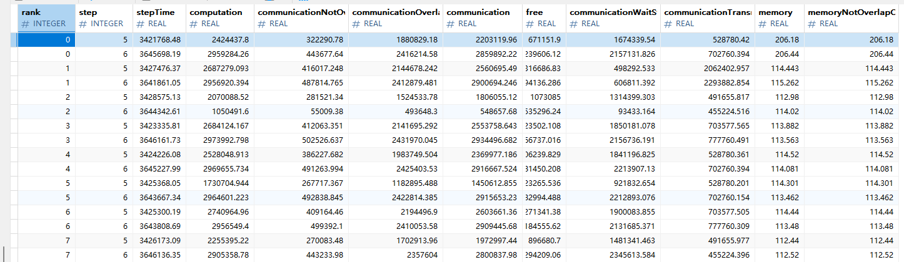

# 集群耗时细粒度分析与比对指南

## 简介
本指南介绍两种集群性能分析功能：
* cluster_time_summary 提供了集群训练过程中迭代耗时拆解，包括计算、通信和内存拷贝等各部分的时间消耗，帮助用户找到性能瓶颈。
* cluster_time_compare_summary 支持两个集群间的性能数据比对，辅助定界性能劣化原因。

## 操作指导
### cluster_time_sumary 集群耗时细粒度拆解

**命令行使能：**
```
msprof-analyze cluster -m cluster_time_summary -d ./cluster_data
```
**参数说明：**  
* `-d`集群数据路径：需要使用Ascend Pytorch Profiler采集AI任务，导出类型包含DB，并使用`torch_npu.profiler.profile.step()`接口划分迭代。  
* 其余参数：与cluster集群分析功能支持的参数一致，详见[参数列表](../cluster_analyse/README.md)  

**输出数据：**  
* 存储位置：cluster_analysis_output/cluster_analysis.db  
* 数据表名：ClusterTimeSummary  


**字段说明：**

| 字段名称                                  | 类型     | 说明                     |
|-------------------------------------------|----------|------------------------|
| rank                                      | INTEGER  | 卡号                     |
| step                                      | INTEGER  | 迭代编号                   |
| stepTime                                  | REAL     | 迭代总耗时                  |
| computation                               | REAL     | NPU上算子的计算总时间           |
| communicationNotOverlapComputation        | REAL     | 未被计算掩盖的通信耗时            |
| communicationOverlapComputation           | REAL     | 计算和通信重叠的时间             |
| communication                            | REAL     | NPU上算子的通信总时间           |
| free                                      | REAL     | 空闲时间，迭代总时间减去计算、通信、拷贝时间 |
| communicationWaitStageTime               | REAL     | 通信中的总等待耗时              |
| communicationTransmitStageTime           | REAL     | 通信中的总传输耗时              |
| memory                                   | REAL     | 拷贝耗时                   |
| memoryNotOverlapComputationCommunication | REAL     | 未被计算、通信掩盖的拷贝耗时         |

备注：表中时间相关字段，统一使用微秒（us）

**输出结果分析：**
* 通过分析计算、通信、内存拷贝、空闲时间占比，找到性能瓶颈。
* 通过比较集群内各卡耗时指标差异，定界性能问题。例如，computing计算耗时波动显著，通常表明存在卡间不同步、计算卡性能不均的情况，而通信传输耗时差异过大时，则需优先排查参数面网络是否存在拥塞或配置异常。
* 配合使用cluster_time_compare_summary功能，可有效定位集群性能劣化根因。


### cluster_time_compare_sumary 集群比对

**通过以下命令行使能：**
```
msprof-analyze cluster -m cluster_time_compare_summary -d ./cluster_data --bp ./base_cluster_data
```
**参数说明：**  
* `-d`集群数据路径：需要先执行cluster_time_summary分析，要求该路径下存在集群数据与cluster_analysis_output/cluster_analysis.db，包含ClusetrTimeSummary表。  
* `-bp`标杆集群数据路径：需要先执行cluster_time_summary分析，要求该路径下存在cluster_analysis_output/cluster_analysis.db，包含ClusetrTimeSummary表。
* 其余参数：与cluster集群分析功能支持的参数一致，详见[参数列表](../cluster_analyse/README.md)  

**输出数据：**  
* 存储位置：cluster_analysis_output/cluster_analysis.db
* 数据表名：ClusterTimeCompareSummary

**字段说明：**

| 字段名称       | 类型     | 说明                               |
|------------|----------|----------------------------------|
| rank       | INTEGER  | 卡号                               |
| step       | INTEGER  | 迭代编号                             |
| {metrics}  | REAL     | 当前集群耗时指标，与ClusterTimeSummary字段一致 |
| {metrics}Base | REAL     | 基准集群的对应耗时                        |
| {metrics}Diff | REAL     | 耗时偏差值（当前集群-基准集群），正值表示当前集群更慢      |

备注：表中时间相关字段，统一使用微秒（us）

**输出结果分析：**
* 按*Diff字段排序找出最大差异项，找到劣化环节。