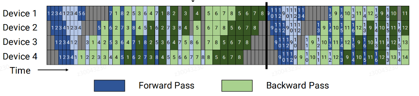
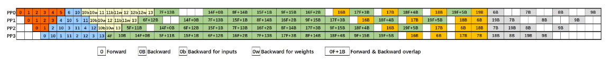
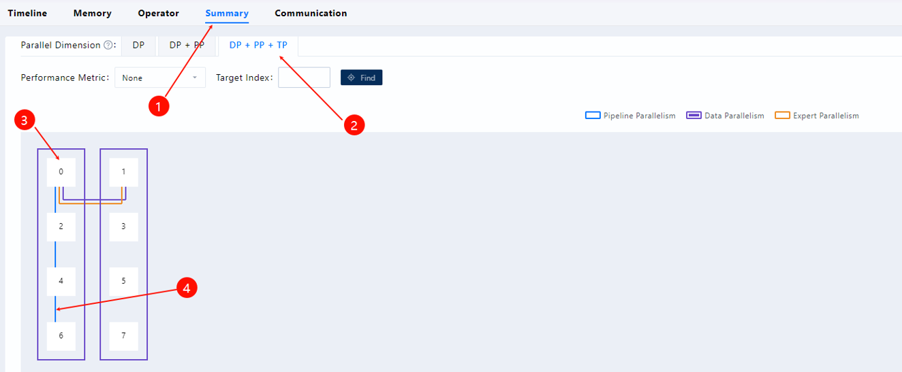
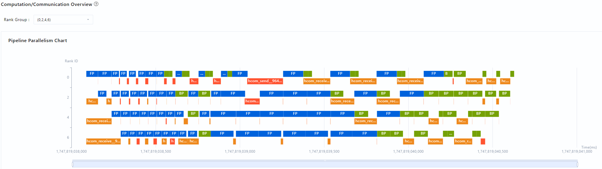

# pp流水图采集和分析指导

## 简介
pp流水图指的是将实际pp域内的流水排布进行可视化呈现，可以分析全局通信与前反向关键耗时信息。对于transformer的模型1f1b、dupipe等pp并行策略，当前无法可视化展示。本节介绍如何采集pp流水图数据、使用msprof-analyze工具分析pp流水图，以及使用MindStudio Insight工具呈现pp流水图。

下面是1F1B和DualPipeV的理论效果图





## 操作指导

用户想看到pp流水图，需要按照以下三个步骤操作。

### 1. profiling数据采集

前反向数据需要通过mstx接口采集，需要先找到代码里前反向相关函数的位置。最终在性能数据timeline上的Ascend HardWare层呈现。

tips：若用户只关注pp流水图，可以设置采集参数profiler_level为Level_none；若还关注前反向、通信以及send和recv的关联关系，设置采集参数profiler_level为Level1或更高级别。


**约束：**：
* 采集数据时，需要将profiling数据导出格式export_type设置为db。
* 以下仅为打点示例，需要根据用户实际代码，准确找到前反向函数的位置，参考下面用装饰器的方式实现打点。

* 若项目使用 Megatron 框架：可直接按照场景一的方法进行打点操作；若项目使用 Mindspeed 框架：需先确认是否开启 DualPipeV 功能，若已开启，则按照场景二的方法进行打点操作；若无法明确区分，如果能找到对应项目中与打点相关的两个核心文件，在这两个文件的打点代码位置处，添加对应的打点逻辑，确保覆盖所有可能场景。

**场景一：**

1. 传统pipeline（不开dualpipe），在```megatron/core/pipeline_parallel/schedules.py```里面添加如下代码（添加在```backward_step```函数定义的后面）：
```python
import torch_npu
def step_wrapper(func, msg: str):
    def wrapper(*args, **kwargs):
        new_msg = {"name": msg}
        mstx_state_step_range_id = torch_npu.npu.mstx.range_start(str(new_msg), torch_npu.npu.current_stream())
        out = func(*args, **kwargs)
        if mstx_state_step_range_id is not None:
            torch_npu.npu.mstx.range_end(mstx_state_step_range_id)
            mstx_state_step_range_id = None
        return out
    return wrapper

forward_step = step_wrapper(forward_step, "forward_step")
backward_step = step_wrapper(backward_step, "backward_step")
```

2. 保存上述脚本文件后，执行训练。训练完成后，在xxx目录下生成性能数据文件目录，用于后续mstt工具分析。

**场景二：**

1. DualPipeV，找到前反向代码，在```mindspeed/core/pipeline_parallel/dualpipev/dualpipev_schedules.py```里面添加如下代码（添加在```forward_backward_pipeline_with_cutinhalf```函数定义的前面）：
```python
import torch_npu
def step_wrapper(func, msg: str):
    def wrapper(*args, **kwargs):
        new_msg = {"name": msg}
        if msg = "forward_step_with_model_graph" and kwargs.get("extra_block_kwargs") is not None:
            new_msg["name"] = "forward_backward_overlaping"
        if "current_microbatch" in kwargs:
            new_msg["current_microbatch"] = kwargs["current_microbatch"]
        if msg == "WeightGradStore_pop" and len(WeightGradStore.cache) == 0:
            mstx_state_step_range_id = None
        else:
            mstx_state_step_range_id = torch_npu.npu.mstx.range_start(str(new_msg), torch_npu.npu.current_stream())
        out = func(*args, **kwargs)
        if mstx_state_step_range_id is not None:
            torch_npu.npu.mstx.range_end(mstx_state_step_range_id)
            mstx_state_step_range_id = None
        return out
    return wrapper

forward_step_with_model_graph = step_wrapper(forward_step_with_model_graph, "forward_step_with_model_graph")
forward_step_no_model_graph = step_wrapper(forward_step_no_model_graph, "forward_step_no_model_graph")
backward_step_with_model_graph = step_wrapper(backward_step_with_model_graph, "backward_step_with_model_graph")
backward_step = step_wrapper(backward_step, "backward_step")
WeightGradStore.pop = step_wrapper(WeightGradStore.pop, "WeightGradStore.pop")
```

同时，采集profiling数据时，如果使用的是MindSpeed，未使用MindSpeed-LLM，需要在prof定义（```prof = torch_npu.profiler.profile(...)```）的后面添加metadata代码：
```
prof.add_metadata('pp_info', json.dumps(
    {
        'pp_type': 'dualpipev',
        'microbatch_num': 10,
    }
))
# microbatch_num根据公式计算实际的值：microbatch_num = global_batch_size // micro_batch_size // data_parallel_size
```
如果使用MindSpeed-LLM，在```mindspeed-llm/training/training.py```中```prof.add_metadata_json('distributed_args'...)```的后面添加metadata代码：
```
prof.add_metadata('pp_info', json.dumps(
    {
        'pp_type': args.schedules_method,
        'microbatch_num': args.global_batch_size // args.micro_batch_size // args.data_parallel_size
    }
))
```

2. 保存上述脚本文件后，执行训练。训练完成后，在xxx目录下生成xxx_ascend_pt性能数据文件目录，用于后续mstt工具分析。

### 2. msprof-analyze工具分析

**命令行使能：**
```
msprof-analyze cluster -m pp_chart -d ./cluster_data
```
**参数说明：**  
* `-d` 第一步打点后采集到的集群数据路径
* 其余参数：与cluster集群分析功能支持的参数一致，详见[参数列表](../cluster_analyse/README.md)  

**输出数据：**  
* 存储位置：每个rank的数据ASCEND_PROFILER_OUTPUT/ascend_pytorch_profiler_{rank_id}.db里面新增一张表StepTaskInfo
* 数据表名：StepTaskInfo

用户无需关注该表字段的具体含义，可以直接使用MindStudio Insight呈现。

**字段说明：**

| 字段名 | 类型 | 含义 |
| ------ | ---- | ---- |
| name    | TEXT    | 前反向信息，对应pp流水图色块显示的名称 |
| startNs | INTEGER | 前反向task在device上开始时间 |
| endNs   | INTEGER | 前反向task在device上结束时间 |
| type    | INTEGER | 类型，不同类型显示不同颜色 |

### 3. MindStudio Insight呈现
MindStudio Insight工具的详细安装和操作请参见[《MindStudio Insight工具用户指南》](https://www.hiascend.com/document/detail/zh/mindstudio/81RC1/GUI_baseddevelopmenttool/msascendinsightug/Insight_userguide_0002.html)。

在MindStudio Insight工具导入mstt工具分析后的性能数据，在Summary页面点击generate后按照如下截图配置：



如下为pp_chart完成pp流水图分析后的呈现效果：

